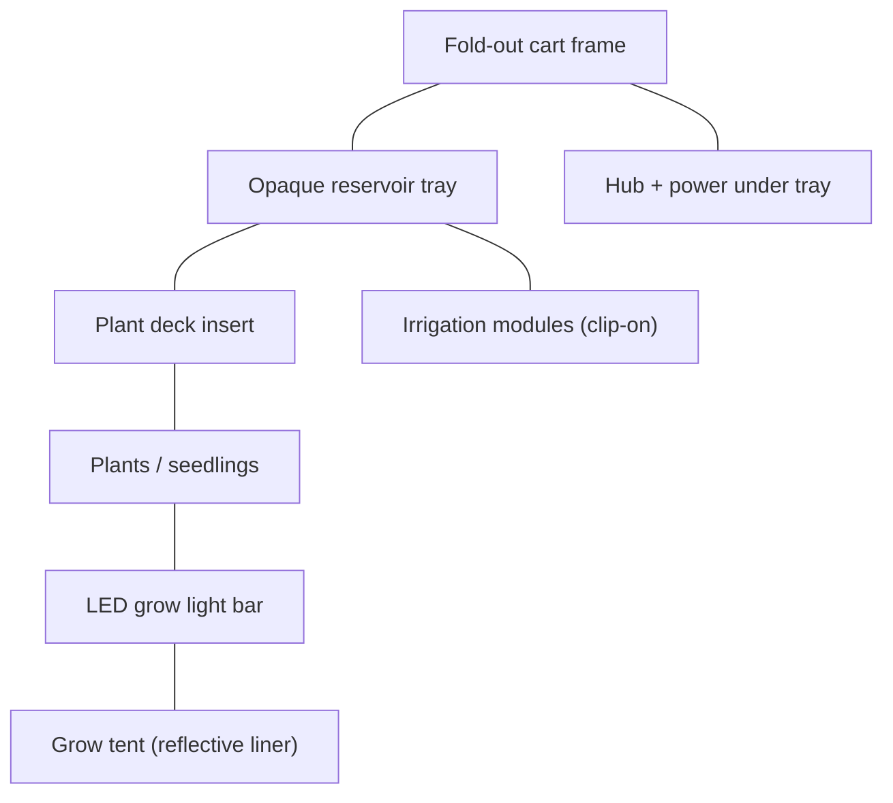
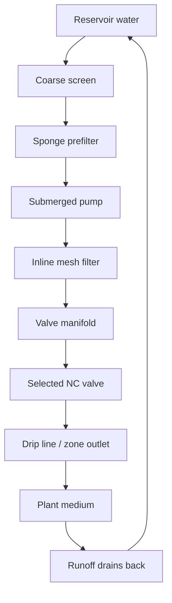
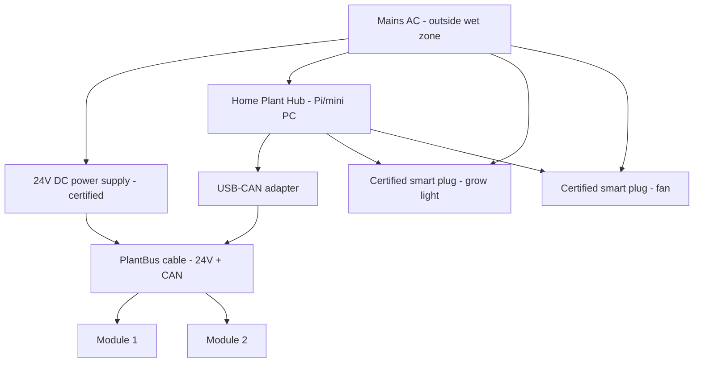

# Hardware Architecture

Physical hardware layout and interconnections for Plant Ark v1 prototype.

## Assembly stack (side view)



## Prototype dimensions

| Dimension | Target | Notes |
|-----------|--------|-------|
| Open footprint | ~600 mm × 800 mm | May adjust to available tray/cart hardware |
| Height with tent | ~1500–1700 mm | Includes light bar clearance |
| Folded thickness | < 300 mm | Collapsible cart target |

## Cart frame

See [cart-frame.md](../hardware/cart-frame.md).

- Foldable/collapsible wheeled frame
- Locking casters
- Drop-in tray support from above
- Tent frame attachment points
- Grow light mount rails
- Under-tray shelf for Hub and power
- Cable routing channels
- Module docking rails along tray edge

## Reservoir tray

See [reservoir-tray.md](../hardware/reservoir-tray.md).

- Opaque, light-blocking material (matte black or dark green)
- Drop-in from above, seated in cart frame
- Fill port, drain port, overflow path
- Pump/filter cassette access opening
- Splash-resistant, not pressure-sealed

## Irrigation module (per unit)

See [irrigation-module.md](../hardware/irrigation-module.md).

```
┌──────────────────────────────┐
│ Dry electronics bay           │  ← above splash line
│ MCU, power, drivers, CAN      │
├──────────────────────────────┤
│ Valve / manifold bay          │  ← 4 NC solenoid outputs
├──────────────────────────────┤
│ Removable pump/filter cassette│  ← submerged in reservoir
└──────────────────────────────┘
```

Each module serves 4 channels and clips to the tray/cart rail.

## Water recirculation path



Bypass path: pump output → restrictor → reservoir (pressure relief when valves closed).

## Electrical architecture



### Power domains

| Domain | Voltage | Location | Notes |
|--------|---------|----------|-------|
| Hub | 5V (USB) / mains | Under tray, dry | Raspberry Pi or mini PC |
| PlantBus | 24V DC | Along tray edge | Fused per module, reverse-polarity protected |
| Module pump | 12V DC (from module regulator) | Submerged cassette | Brushless submersible |
| Module valves | 24V or 12V (module-dependent) | Valve bay | NC solenoid |
| Grow light | Mains AC | Above plants, via certified plug | No DIY mains in tent |
| Fan | Mains AC | Tent vent, via certified plug | Manual or scheduled |

## PlantBus physical connection

See [plantbus-physical-layer.md](../protocol/plantbus-physical-layer.md).

- 24V DC power + CAN data over Cat5/Cat6 cable (prototype)
- M12 A-coded 5-pin connector (production target)
- Daisy-chain or bus topology
- 120 Ω termination at bus ends
- Labels: **NOT ETHERNET**

## Module docking (top view)

```
┌─────────────────────────────────────────────┐
│              plant deck                      │
│  ┌─────┐ ┌─────┐ ┌─────┐ ┌─────┐           │
│  │ ch1 │ │ ch2 │ │ ch3 │ │ ch4 │  mod 1    │
│  └─────┘ └─────┘ └─────┘ └─────┘           │
├─────────────────────────────────────────────┤
│ ■ mod1  ■ mod2  ■ mod3  ■ mod4  ■ hub     │
└─────────────────────────────────────────────┘
         ↑ clip-on docking points
```

## v1 hardware MVP scope

| Item | Quantity |
|------|----------|
| Fold-out cart | 1 |
| Opaque reservoir tray | 1 |
| Removable plant deck | 1 |
| Soft grow tent | 1 |
| LED grow light bar | 1 |
| 4-channel irrigation module | 1 (bench prototype) |
| Home Plant Hub | 1 |
| Optional Meshtastic node | 0–1 |

## Related documents

- [System architecture](system-architecture.md)
- [Irrigation module](../hardware/irrigation-module.md)
- [Pump/filter cassette](../hardware/pump-filter-cassette.md)
- [Electrical safety](../safety/electrical-safety.md)
- [Component catalog](../references/component-catalog.md)
