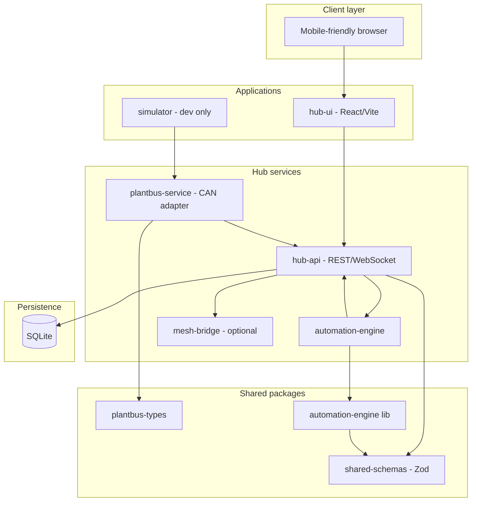
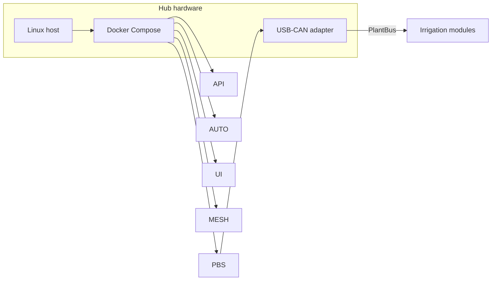

# Software Architecture

The Home Plant Hub runs on Linux (Raspberry Pi 4/5 or mini PC) and orchestrates all Plant Ark software services.

## Service map



## Planned monorepo structure

For future implementation (not in scope for this documentation build):

```
plant-ark/
  apps/
    hub-api/          REST/WebSocket API, registry, command queue
    hub-ui/           Local dashboard, setup wizard
    simulator/        Fake PlantBus modules for dev
  packages/
    plantbus-types/   Message type definitions
    shared-schemas/   Zod schemas for entities
    automation-engine/ Watering rules, schedules, safety checks
  firmware/
    nursery-module-4ch/
    environment-module/
  docker-compose.yml
```

## Service responsibilities

### hub-api

- REST and WebSocket API for the UI
- Module and plant registry CRUD
- Sensor reading ingestion and storage
- Actuation event logging
- Alert management
- Command queue for watering and environment actions

### plantbus-service

- USB-CAN adapter communication
- Module discovery via HELLO messages
- Heartbeat monitoring and offline detection
- Sensor report ingestion
- Command dispatch (water, identify, config)
- Command ACK and event handling

### automation-engine

- Periodic evaluation of watering rules
- Light schedule execution
- Safety precondition checks before actuation
- Daily dose limits and quiet hours enforcement
- Maintenance reminder generation

### hub-ui

- Dashboard with system status
- Module discovery and identify flow
- Plant/channel naming and assignment
- Manual watering controls
- Automation configuration
- Alert list and acknowledgement

### mesh-bridge

- Accepts status summaries and alerts from hub-api
- Publishes to Meshtastic (stub in v1 software MVP)
- Rate-limited: summaries every 30–60 min, alerts deduplicated

### simulator (development)

- Emulates 2× 4-channel modules on PlantBus
- Emits HELLO, HEARTBEAT, SENSOR_REPORT
- Accepts IDENTIFY and WATER commands
- Responds with COMMAND_ACK and water_complete events

## Technology stack

| Layer | Choice | Rationale |
|-------|--------|-----------|
| Runtime | Node.js + TypeScript | Monorepo consistency, shared types |
| API framework | Fastify | Performance, schema validation |
| UI | React + Vite | Mobile-friendly SPA |
| Database | SQLite | Local-first, no external DB |
| Schemas | Zod | Runtime validation + TypeScript inference |
| Orchestration | Docker Compose | Local dev parity |
| MQTT | Optional | Not required for v1 |

## Key workflows

| Workflow | Primary services | Spec |
|----------|------------------|------|
| Module discovery | plantbus-service → hub-api | [001-module-discovery](../../specs/001-module-discovery/spec.md) |
| Manual watering | hub-ui → hub-api → plantbus-service | [003-manual-watering](../../specs/003-manual-watering/spec.md) |
| Automated watering | automation-engine → hub-api → plantbus-service | [004-automated-watering](../../specs/004-automated-watering/spec.md) |
| Safety interlocks | automation-engine + module firmware | [005-safety-interlocks](../../specs/005-safety-interlocks/spec.md) |
| Meshtastic publish | hub-api → mesh-bridge | [008-meshtastic-status-alerts](../../specs/008-meshtastic-status-alerts/spec.md) |

## Deployment model



All services run on the local Hub. No cloud services required for normal operation.

## Related documents

- [System architecture](system-architecture.md)
- [Hardware architecture](hardware-architecture.md)
- [Data model](../data-model/entities.md)
- [PlantBus messages](../protocol/plantbus-messages.md)
