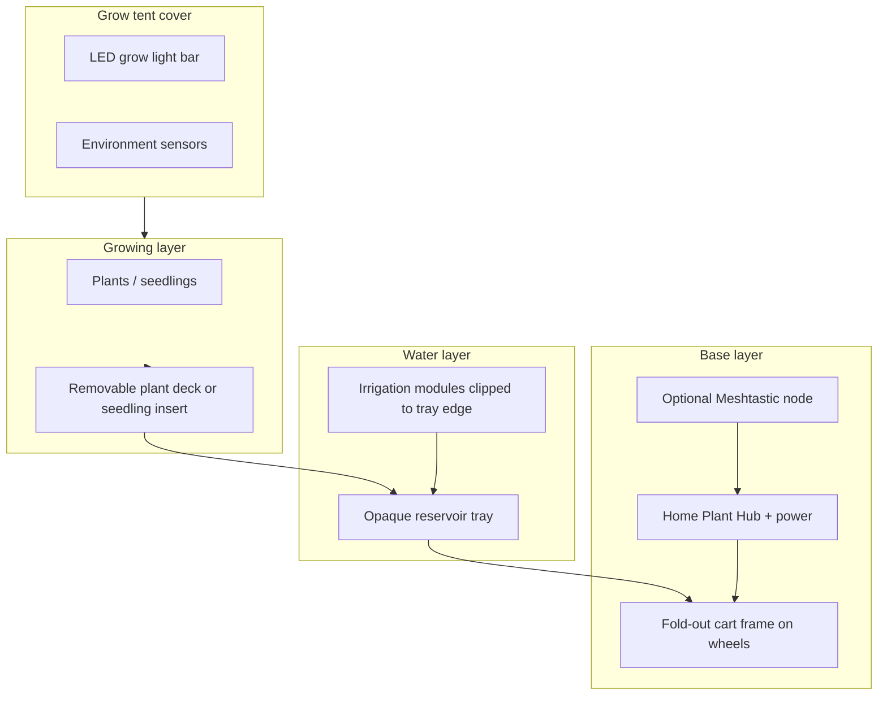
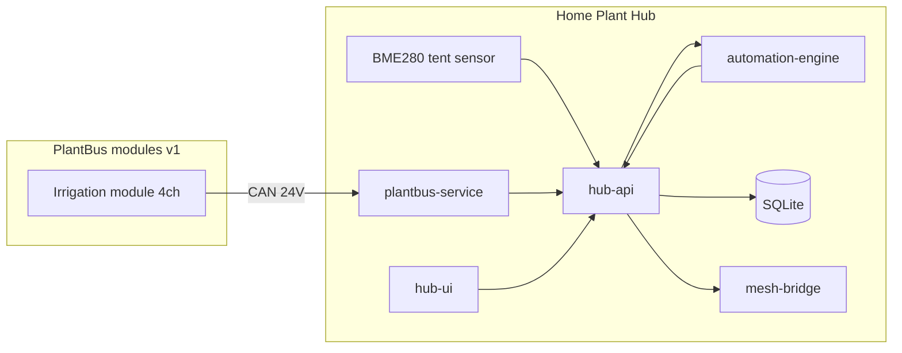

# System Architecture

Plant Ark is a local-first modular plant-care platform. This document describes the full physical and logical system stack.

## Physical stack



## Logical components

| Component | Role | v1 scope |
|-----------|------|----------|
| Fold-out cart frame | Physical foundation, tent support, module docking | 1 unit |
| Reservoir tray | Recirculating water storage, light-blocked | 1 per shelf/tray |
| Plant deck | Supports pots or seedling inserts, drains to tray | 1 removable deck |
| Grow tent | Reflective soft cover, access, vents | 1 tent |
| Irrigation module | 4-channel pump/valve/sensor unit | 1–2 modules (4–8 channels) |
| Home Plant Hub | Discovery, automation, UI, logging, environment sensors (BME280) | 1 hub |
| Meshtastic node | Optional status/alerts | Optional |

## Operating modes

### Seedling mode

- Plant deck uses seedling tray insert with watering zones
- Each module channel waters one zone of seedlings
- Suitable for seed starting, microgreens, cuttings, propagation

### Plant mode

- Plant deck uses pot insert
- Each module channel waters one pot
- Suitable for herbs, overwintering plants, chillies, citrus, ornamentals

The same cart, tray, controller, and modules support both modes. The user swaps deck inserts and tubing layouts.

## Data and control flow



v2+ may add a dedicated **environment module** on PlantBus. v1 reads tent temperature and humidity from a BME280 connected directly to the Hub.

## Module topology (top view)

v1 target: **1–2 modules** (4–8 channels). Long-term: up to 5 modules × 4 channels = 20 plants/zones.

```
┌─────────────────────────────────────────────┐
│ plant deck / seedling tray                   │
│                                             │
│  plants / seedlings                         │
│                                             │
├───────────┬───────────┬─────────────────────┤
│  mod 1    │  mod 2    │  controller (Hub)   │  ← v1: 1–2 modules shown
└───────────┴───────────┴─────────────────────┘
     (long-term: up to mod 5 along tray edge)
```

## User setup flow

1. Unfold cart and lock casters
2. Drop reservoir tray in from above
3. Place plant deck or seedling insert on tray
4. Clip irrigation modules to tray edge
5. Route drip lines to plants/zones
6. Install grow tent over frame
7. Mount LED grow light bar
8. Connect modules to Hub via PlantBus
9. Power on Hub — modules auto-register
10. Name modules/channels and assign plants via UI

## Design principles

See [constitution.md](../../constitution.md). Key architectural decisions:

- **One reservoir per tray/shelf** (not one giant whole-tent reservoir)
- **One pump + four NC valves per module** (not four pumps)
- **CAN bus** for PlantBus data (RS-485 acceptable fallback)
- **Separate mesh-bridge service** for Meshtastic
- **No cloud dependency** for core operation

## Related documents

- [Software architecture](software-architecture.md)
- [Hardware architecture](hardware-architecture.md)
- [PlantBus overview](../protocol/plantbus-overview.md)
- [Glossary](../glossary.md)
