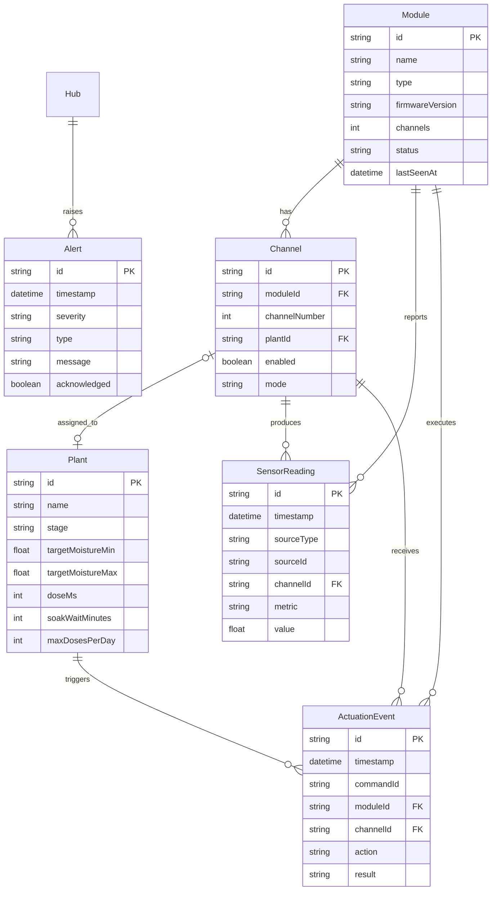

# Data Model — Entities

Reference data model for Plant Ark Hub persistence and API. TypeScript shapes shown for future implementation; this document is the specification source.

## Entity relationship diagram



## Module

Represents a physical PlantBus module (irrigation or environment).

```typescript
type Module = {
  id: string;                    // permanent module_id e.g. "pm-8f3a91c2"
  name: string | null;           // user-assigned name e.g. "Top shelf left"
  type: "nursery-4ch-v1" | "environment-v1";
  firmwareVersion: string;
  channels: number;
  capabilities: string[];
  lastSeenAt: string | null;     // ISO 8601
  status: "online" | "offline" | "fault";
};
```

| Field | Constraints |
|-------|-------------|
| `id` | Immutable; from module firmware |
| `name` | User-set; nullable until named |
| `type` | Enum; from HELLO message |
| `status` | Derived from heartbeat timeout |

## Channel

One watering output on an irrigation module.

```typescript
type Channel = {
  id: string;                    // "{moduleId}/{channelNumber}" e.g. "pm-8f3a91c2/2"
  moduleId: string;
  channelNumber: number;         // 1–4
  plantId: string | null;
  enabled: boolean;
  mode: "pot" | "seedling-zone";
  moistureSensorEnabled: boolean;
  valveEnabled: boolean;
};
```

Channels are auto-created when a module registers (4 per irrigation module).

## Plant

User-defined plant or zone with watering profile.

```typescript
type Plant = {
  id: string;
  name: string;
  species?: string;
  stage: "seedling" | "cutting" | "overwintering" | "herb" | "other";
  notes?: string;
  targetMoistureMin: number;     // 0.0–1.0 normalized
  targetMoistureMax: number;
  doseMs: number;                // watering burst duration
  soakWaitMinutes: number;       // wait before re-measuring moisture
  maxDosesPerDay: number;
  quietHours?: {
    start: string;               // "HH:MM" 24h
    end: string;
  };
};
```

Example profile:

```json
{
  "name": "Tomato seedlings",
  "stage": "seedling",
  "targetMoistureMin": 0.42,
  "targetMoistureMax": 0.62,
  "doseMs": 5000,
  "soakWaitMinutes": 10,
  "maxDosesPerDay": 4
}
```

## SensorReading

Time-series sensor data point.

```typescript
type SensorReading = {
  id: string;
  timestamp: string;             // ISO 8601
  sourceType: "module" | "environment" | "hub";
  sourceId: string;                // module_id or sensor id
  channelId?: string;
  metric:
    | "soil_moisture_raw"
    | "soil_moisture_norm"
    | "water_level"
    | "water_temperature_c"
    | "pump_current_ma"
    | "air_temperature_c"
    | "humidity_percent"
    | "co2_ppm"
    | "light_lux"
    | "reservoir_level_percent";
  value: number | boolean | string | null;
  unit?: string;
};
```

## ActuationEvent

Log of every actuation command and outcome.

```typescript
type ActuationEvent = {
  id: string;
  timestamp: string;
  commandId: string;
  moduleId: string;
  channelId?: string;
  action:
    | "water"
    | "pump_on"
    | "pump_off"
    | "valve_open"
    | "valve_close"
    | "light_on"
    | "light_off"
    | "fan_on"
    | "fan_off";
  requestedDurationMs?: number;
  actualDurationMs?: number;
  result: "success" | "failed" | "cancelled" | "safety_blocked";
  reason?: string;
};
```

## Alert

System alert raised by Hub or module.

```typescript
type Alert = {
  id: string;
  timestamp: string;
  severity: "info" | "warning" | "critical";
  type:
    | "leak_detected"
    | "reservoir_low"
    | "pump_fault"
    | "module_offline"
    | "water_too_warm"
    | "temperature_low"
    | "temperature_high"
    | "filter_due"
    | "manual_attention";
  message: string;
  acknowledged: boolean;
};
```

## PlantBus message mapping

| PlantBus message | Entity updates |
|------------------|----------------|
| HELLO | Create/update Module; create Channels |
| HEARTBEAT | Update Module.lastSeenAt, status |
| SENSOR_REPORT | Insert SensorReading rows |
| EVENT water_complete | Insert ActuationEvent |
| EVENT fault | Insert Alert; update Module.status |

## SQLite schema notes (future implementation)

- `modules`, `channels`, `plants`, `sensor_readings`, `actuation_events`, `alerts` tables
- Index on `sensor_readings(timestamp, channelId)`
- Index on `actuation_events(timestamp, moduleId)`
- `channels.plantId` foreign key to `plants.id`
- Retention policy: sensor readings > 90 days archived (configurable)

## Related documents

- [PlantBus messages](../protocol/plantbus-messages.md)
- [Software architecture](../architecture/software-architecture.md)
- [Automated watering](../../specs/004-automated-watering/spec.md)
