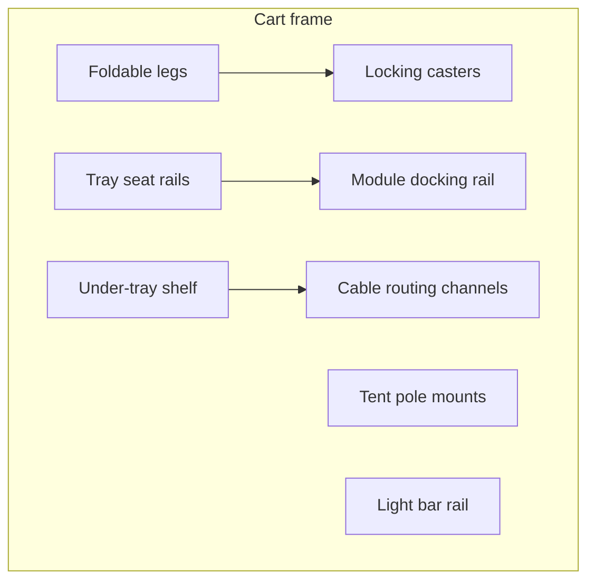

# Cart Frame

The fold-out cart frame is the physical foundation of Plant Ark.

## Purpose

Provides a stable, portable, wheeled structure that supports the reservoir tray, grow tent, grow lights, irrigation module docking, and under-tray storage for the Hub and power distribution.

## Requirements

| ID | Requirement |
|----|-------------|
| REQ-HW-CF-001 (Ubiquitous) | The cart frame shall be foldable or collapsible for storage. |
| REQ-HW-CF-002 (Ubiquitous) | The cart frame shall have wheeled casters, ideally with locking mechanism. |
| REQ-HW-CF-003 (Ubiquitous) | The cart frame shall remain stable when the reservoir tray is filled with water. |
| REQ-HW-CF-004 (Ubiquitous) | The cart frame shall support drop-in of the reservoir tray from above. |
| REQ-HW-CF-005 (Ubiquitous) | The cart frame shall provide structural attachment points for the grow tent. |
| REQ-HW-CF-006 (Ubiquitous) | The cart frame shall provide a mount for the LED grow light bar. |
| REQ-HW-CF-007 (Ubiquitous) | The cart frame shall have an under-tray shelf or mounting area for the Hub and power supplies. |
| REQ-HW-CF-008 (Ubiquitous) | The cart frame shall include cable routing paths for PlantBus and sensor cables. |
| REQ-HW-CF-009 (Ubiquitous) | The cart frame shall provide module docking points along the tray edge rail. |

## Target dimensions

| Parameter | Target | Tolerance |
|-----------|--------|-----------|
| Open footprint | 600 mm × 800 mm | Adjust to tray size |
| Height (frame only) | ~800–1000 mm | Depends on tent design |
| Folded thickness | < 300 mm | Storage target |
| Tray seat depth | Matches tray lip | Tray must not shift when filled |

## Design aesthetic

- Powder-coated metal frame (matte black or dark green)
- Camping-cart inspired folding mechanism
- Large handles for unfolding and repositioning
- Visible but tidy — not hidden appliance aesthetics
- Repairable with standard fasteners

## Structural elements

## Module docking rail

- Continuous rail along one or more tray edges
- Clip mechanism on irrigation modules engages rail
- Modules space evenly; v1 supports 1–2 modules, long-term up to 5
- Rail height positions module dry bay above splash line

## Materials (prototype)

| Component | Material | Notes |
|-----------|----------|-------|
| Frame tubes | Steel or aluminium | Powder-coated |
| Hinges | Steel pin hinges | Rated for load |
| Casters | 75–100 mm locking casters | Soft wheel for indoor |
| Tray seat | Frame-integrated rails | Match tray outer lip |

## Assembly notes

1. Unfold legs and lock casters
2. Verify tray seat is level (use spirit level)
3. Attach tent pole mounts before dropping tray
4. Route PlantBus cable through cable channels before clipping modules
5. Mount Hub and PSU on under-tray shelf — keep above floor splash zone

## Related documents

- [Hardware architecture](../architecture/hardware-architecture.md)
- [Reservoir tray](reservoir-tray.md)
- [Irrigation module](irrigation-module.md)
- [Grow tent](grow-tent.md)
