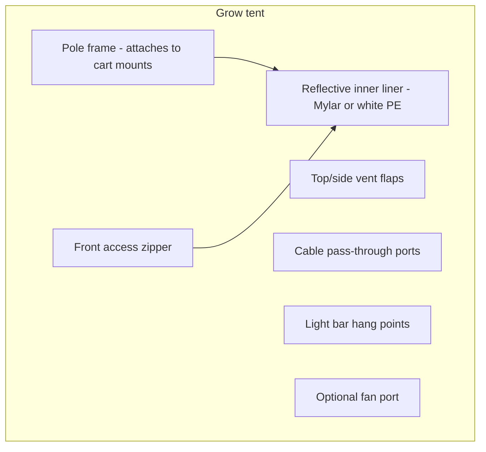

# Grow Tent

The soft grow tent is a removable reflective cover that fits over the cart frame.

## Purpose

Creates a controlled microclimate for seedlings and overwintering plants. Reflects grow light inward, provides front access, ventilation, and cable pass-throughs.

## Requirements

| ID | Requirement |
|----|-------------|
| REQ-HW-GT-001 (Ubiquitous) | The grow tent shall have a reflective internal lining. |
| REQ-HW-GT-002 (Ubiquitous) | The grow tent shall provide front access via zipper or roll-up flap. |
| REQ-HW-GT-003 (Ubiquitous) | The grow tent shall include vent openings for air exchange. |
| REQ-HW-GT-004 (Ubiquitous) | The grow tent shall provide cable pass-through ports for PlantBus and sensor cables. |
| REQ-HW-GT-005 (Ubiquitous) | The grow tent shall provide mounting points for the LED grow light bar. |
| REQ-HW-GT-006 (Ubiquitous) | The grow tent shall provide optional sensor mounting points. |
| REQ-HW-GT-007 (Ubiquitous) | The grow tent shall provide an optional fan port. |
| REQ-HW-GT-008 (Ubiquitous) | The grow tent shall be removable without disassembling the cart frame. |
| REQ-HW-GT-009 (Ubiquitous) | The grow tent shall not block access to tray fill port or module clip points when front flap is open. |

## Target dimensions

| Parameter | Target |
|-----------|--------|
| Internal width | Match cart open width (~600 mm) |
| Internal depth | Match cart open depth (~800 mm) |
| Internal height | ~1200–1400 mm (plants + light clearance) |
| Total height with light | ~1500–1700 mm |

## Tent structure

## Ventilation

| Opening | Purpose | v1 control |
|---------|---------|------------|
| Top vent | Hot air exhaust | Passive or fan-assisted |
| Side vent | Fresh air intake | Passive flap |
| Fan port | Inline duct fan | Manual or scheduled on/off via certified plug |

v1: light schedule + temperature/humidity monitoring + manual fan control. Avoid controlling many AC devices until enclosure safety is validated.

## Cable pass-throughs

- PlantBus cable: side port with grommet, labelled
- Sensor cables: small ports near top for environment module
- Light power: routed outside tent via certified plug cord (no mains inside wet zone)

## Reflective lining

- Mylar or white polyethylene interior
- Seams taped to minimise light leaks
- Light leaks are undesirable but not critical for v1 (not a photo-period lab)

## Related documents

- [Cart frame](cart-frame.md)
- [Environment and light control](../../specs/007-environment-light-control/spec.md)
- [Electrical safety](../safety/electrical-safety.md)
