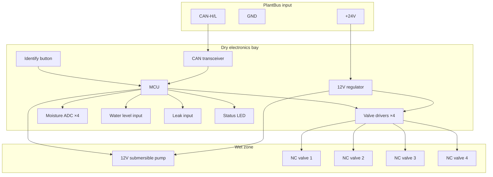

# Irrigation Module (4-Channel)

A clip-on 4-channel watering unit that docks to the reservoir tray edge.

## Purpose

Each module serves 4 plants or 4 watering zones. It contains pump, filter, valves, moisture sensors, and local safety firmware. Modules connect to the Home Plant Hub via PlantBus.

## Module structure

```
┌──────────────────────────────┐
│ Dry electronics bay           │  MCU, power, drivers, CAN transceiver
│ [Identify btn] [Status LED]   │
├──────────────────────────────┤
│ Valve / manifold bay          │  4× NC solenoid valves → drip outputs
├──────────────────────────────┤
│ Removable pump/filter cassette│  Submerged in reservoir
└──────────────────────────────┘
         ↑ clips to tray rail
```

## Requirements

| ID | Requirement |
|----|-------------|
| REQ-HW-IM-001 (Ubiquitous) | The irrigation module shall serve exactly 4 plant or zone channels. |
| REQ-HW-IM-002 (Ubiquitous) | The irrigation module shall clip onto the tray or cart rail without tools. |
| REQ-HW-IM-003 (Ubiquitous) | The dry electronics bay shall remain above the splash line during operation. |
| REQ-HW-IM-004 (Ubiquitous) | The irrigation module shall contain one submerged pump in a removable filter cassette. |
| REQ-HW-IM-005 (Ubiquitous) | The irrigation module shall have 4 normally-closed solenoid valve outputs. |
| REQ-HW-IM-006 (Ubiquitous) | The irrigation module shall accept 4 moisture sensor inputs. |
| REQ-HW-IM-007 (Ubiquitous) | The irrigation module shall connect to the Hub via PlantBus. |
| REQ-HW-IM-008 (Ubiquitous) | The irrigation module shall have a physical identify button and status LED. |
| REQ-HW-IM-009 (Ubiquitous) | The irrigation module shall be addable and removable independently of other modules. |
| REQ-HW-IM-010 (Ubiquitous) | The irrigation module shall have a permanent unique module ID stored in firmware. |

## Capabilities (firmware)

```json
{
  "module_id": "pm-8f3a91c2",
  "module_type": "nursery-4ch-v1",
  "firmware_version": "0.1.0",
  "channels": 4,
  "capabilities": [
    "moisture",
    "pump",
    "valves",
    "water_level",
    "leak_sensor",
    "local_safety"
  ]
}
```

## Electrical block diagram



## Watering control sequence (module firmware)

1. Receive WATER command from Hub
2. Verify: module online, water level OK, no leak, no duplicate command ID
3. Open selected valve
4. Start pump
5. Run for `duration_ms` (max `max_duration_ms`)
6. Stop pump
7. Close selected valve
8. Optional short bypass/flush cycle
9. Report `water_complete` event with moisture before/after
10. Log locally if bus unavailable

## Module registration flow

1. Module powers up → sends HELLO on PlantBus
2. Hub records `module_id` and creates 4 channel slots
3. User presses identify button → UI highlights module
4. User names module and channels in UI

Logical channel IDs: `pm-8f3a91c2/1` through `pm-8f3a91c2/4`

## v1 vs long-term

| Parameter | v1 prototype | Long-term target |
|-----------|--------------|------------------|
| Modules per tray | 1–2 | Up to 5 |
| Channels total | 4–8 | 20 |
| Pump | 1× 12V brushless submersible | Same |
| Valves | 4× NC solenoid | Same |

## Related documents

- [Pump/filter cassette](pump-filter-cassette.md)
- [Valves manifold](valves-manifold.md)
- [PlantBus messages](../protocol/plantbus-messages.md)
- [Safety interlocks](../../specs/005-safety-interlocks/spec.md)
- [Component catalog](../references/component-catalog.md)
