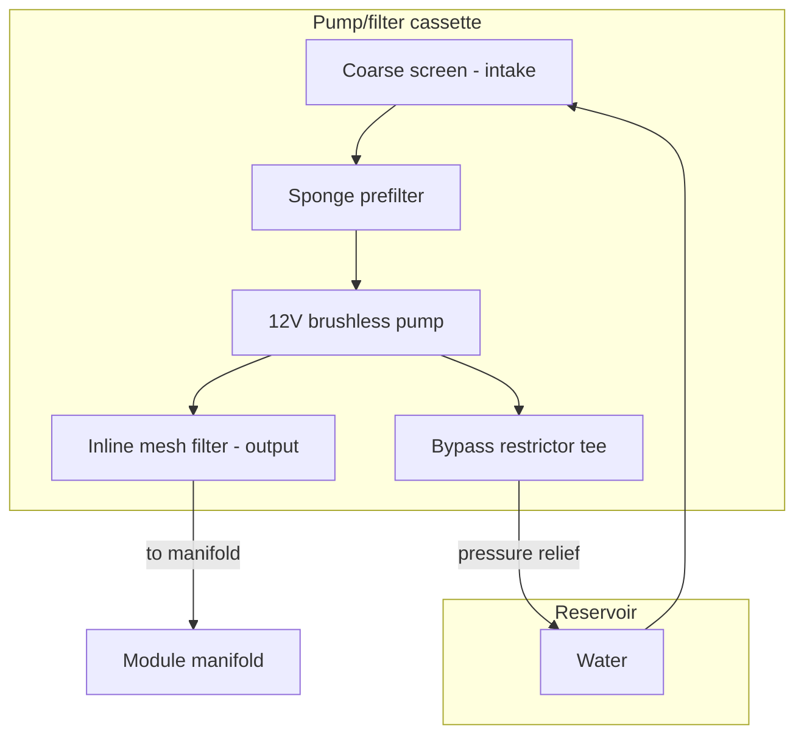

# Pump / Filter Cassette

Removable submerged unit containing the pump and filtration stack.

## Purpose

Draws water from the reservoir, filters particles, and feeds the valve manifold. Designed for tool-free removal, rinsing, and replacement.

## Filtration stack

```
coarse screen
  ↓
aquarium sponge / foam prefilter
  ↓
pump (12V DC brushless submersible)
  ↓
inline mesh filter
  ↓
→ valve manifold
```

## Requirements

| ID | Requirement |
|----|-------------|
| REQ-HW-PF-001 (Ubiquitous) | The pump/filter cassette shall be removable without tools. |
| REQ-HW-PF-002 (Ubiquitous) | The pump/filter cassette shall be easy to rinse and reinsert. |
| REQ-HW-PF-003 (Ubiquitous) | The pump/filter cassette shall protect the pump from debris. |
| REQ-HW-PF-004 (Ubiquitous) | The pump/filter cassette shall protect valves and drippers from particles. |
| REQ-HW-PF-005 (Ubiquitous) | The pump/filter cassette shall minimise light exposure to the pump intake path. |
| REQ-HW-PF-006 (Ubiquitous) | The pump/filter cassette shall drain back into the reservoir when removed. |
| REQ-HW-PF-007 (Ubiquitous) | The pump/filter cassette shall contain one 12V DC brushless submersible pump. |

## Pump selection criteria

| Criterion | Target |
|-----------|--------|
| Type | 12V DC brushless submersible aquarium/fountain pump |
| Flow rate | 200–400 L/h (sized for 4 drip lines + bypass) |
| Head | Sufficient for 300 mm lift to valve manifold |
| Noise | Quiet operation (< 40 dB at 1 m) |
| Replacement | Off-the-shelf, cheap, user-replaceable |

**Why submerged over peristaltic (v1):** cheaper, quieter, easier to source, good for recirculation. Peristaltic remains an option for a later precision-dosing variant.

## Cassette cross-section



## Bypass / pressure relief

When all valves are closed, the pump output needs a path back to the reservoir:

- Bypass tee after inline mesh filter
- Restrictor orifice limits bypass flow
- Prevents pressure spikes and aids priming
- Enables flush mode (pump runs, all valves closed, bypass active)

## Removal procedure

1. Stop all watering (Hub sends stop or power off module)
2. Lift cassette straight up from tray slot
3. Allow water to drain back into reservoir
4. Rinse sponge and screen under tap
5. Inspect pump impeller for debris
6. Reinsert cassette into guide rails

## Maintenance schedule

| Task | Frequency |
|------|-----------|
| Rinse sponge and screen | Weekly |
| Inspect pump impeller | Monthly |
| Replace sponge | Every 3–6 months |
| Replace pump (if worn) | As needed |

Hub generates filter cleaning reminders — see [alerts and maintenance](../../specs/006-alerts-maintenance/spec.md).

## Related documents

- [Irrigation module](irrigation-module.md)
- [Valves manifold](valves-manifold.md)
- [Reservoir tray](reservoir-tray.md)
- [Water quality](../safety/water-quality.md)
- [Component catalog](../references/component-catalog.md)
