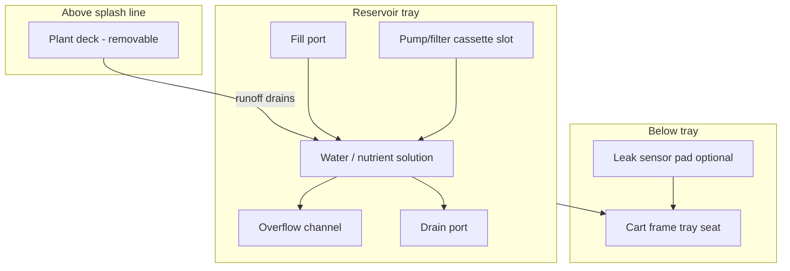

# Reservoir Tray

The opaque recirculating reservoir tray is the wet core of Plant Ark.

## Purpose

Stores recirculating water/nutrient solution, catches plant runoff, blocks light from standing water, and provides access for the pump/filter cassette.

## Requirements

| ID | Requirement |
|----|-------------|
| REQ-HW-RT-001 (Ubiquitous) | The reservoir tray shall be opaque to block light from standing water. |
| REQ-HW-RT-002 (Ubiquitous) | The reservoir tray shall drop into the cart frame from above. |
| REQ-HW-RT-003 (Ubiquitous) | The reservoir tray shall hold recirculating water/nutrient solution. |
| REQ-HW-RT-004 (Ubiquitous) | The reservoir tray shall be covered by the removable plant deck during operation. |
| REQ-HW-RT-005 (Ubiquitous) | The reservoir tray shall allow plant runoff to drain back into the reservoir. |
| REQ-HW-RT-006 (Ubiquitous) | The reservoir tray shall have a fill port accessible without removing the plant deck. |
| REQ-HW-RT-007 (Ubiquitous) | The reservoir tray shall have a drain port for emptying and flushing. |
| REQ-HW-RT-008 (Ubiquitous) | The reservoir tray shall have an overflow path to prevent uncontrolled spillage. |
| REQ-HW-RT-009 (Ubiquitous) | The reservoir tray shall provide access for pump/filter cassette insertion and removal. |
| REQ-HW-RT-010 (Ubiquitous) | The reservoir tray shall be removable from the cart for cleaning. |
| REQ-HW-RT-011 (Ubiquitous) | The reservoir tray shall be splash-resistant but not require pressure sealing. |

## Design constraints

- **Not airtight** — light-sealed and splash-resistant only
- **One reservoir per tray/shelf** — avoids whole-tent shared reservoir in v1
- **No grow-light exposure** to standing water (opaque walls + deck cover)

## Cross-section



## Port specifications

| Port | Location | Purpose |
|------|----------|---------|
| Fill port | Side wall, above normal water line | Top-up without deck removal; cap or flip-lid |
| Drain port | Bottom or low side | Empty for cleaning; ball valve or screw cap |
| Overflow | Top edge or dedicated channel | Routes excess to catch tray or visible outlet |

## Volume estimate

For a 600 mm × 800 mm tray with 80 mm water depth:

- Approximate volume: 38 L
- Operating fill: 25–35 L (leave headroom for runoff)
- Minimum operating level: sensor-triggered low threshold

## Materials (prototype)

| Component | Material | Notes |
|-----------|----------|-------|
| Tray body | HDPE or PP plastic | Opaque, food-safe preferred |
| Colour | Matte black or dark green | Light blocking |
| Seals | EPDM gaskets at ports | Splash-resistant only |
| Cassette guide | Integrated rails | Tool-free cassette insertion |

## Water path integration

```
reservoir water
  → filter cassette (coarse screen → sponge → pump → inline mesh)
  → valve manifold
  → selected valve
  → drip line
  → plant medium
  → runoff → reservoir
```

See [pump-filter-cassette.md](pump-filter-cassette.md) and [valves-manifold.md](valves-manifold.md).

## Maintenance

| Task | Frequency | Action |
|------|-----------|--------|
| Rinse tray | Monthly | Drain, scrub, refill |
| Flush system | Monthly | Drain port + run flush cycle |
| Check overflow | Weekly | Visual inspection |
| Replace water | Every 2–4 weeks | Full drain and refill (plant-dependent) |

## Related documents

- [Plant deck](plant-deck.md)
- [Pump/filter cassette](pump-filter-cassette.md)
- [Water quality](../safety/water-quality.md)
- [Hardware architecture](../architecture/hardware-architecture.md)
