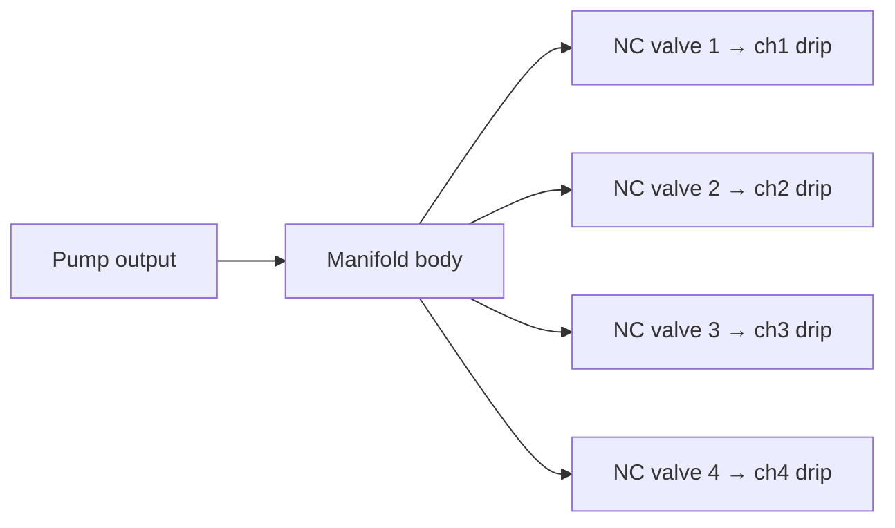

# Valves Manifold

Four-channel normally-closed solenoid valve manifold distributing pump output to drip lines.

## Purpose

Routes filtered pump output to one of four plant/zone drip lines. Only one valve open at a time. Fail-safe: all valves closed when de-energised.

## Requirements

| ID | Requirement |
|----|-------------|
| REQ-HW-VM-001 (Ubiquitous) | The valve manifold shall have 4 independently controllable outputs. |
| REQ-HW-VM-002 (Ubiquitous) | All valves shall be normally-closed solenoid type. |
| REQ-HW-VM-003 (Ubiquitous) | The valve manifold shall allow only one valve open at a time. |
| REQ-HW-VM-004 (Ubiquitous) | The valve manifold shall close all valves when power is removed. |
| REQ-HW-VM-005 (Ubiquitous) | The valve manifold input shall accept filtered water from the pump/filter cassette. |
| REQ-HW-VM-006 (Ubiquitous) | Each output shall connect to a drip line via barbed or push-fit fitting. |

## Valve selection: NC solenoid (v1 preferred)

| Criterion | NC solenoid | Latching solenoid |
|-----------|-------------|-------------------|
| Fail-safe (power off) | Closed | May remain in last state |
| Driver complexity | Simple ON/OFF | H-bridge required |
| Power during watering | Acceptable for short bursts | Lower |
| v1 recommendation | **Preferred** | Future low-power variant |

**Reasoning:** Power off = closed. Simpler driver electronics. Safer failure behaviour. Short watering bursts mean power draw is acceptable. Pump and valve must both be active for water to flow.

## Manifold layout

## Watering sequence (valve + pump)

| Step | Valve state | Pump state |
|------|-------------|------------|
| Idle | All closed | Off |
| Pre-check | All closed | Off |
| Open target valve | One open | Off |
| Start pump | One open | On |
| Run dose | One open | On |
| Stop pump | One open | Off |
| Close valve | All closed | Off |

**Rule:** Never run pump with all valves closed unless bypass/flush mode is explicitly active.

## Drip line outputs

| Output | Connection | Tubing |
|--------|------------|--------|
| Channel 1 | Barbed fitting | Dark/opaque 4–6 mm LDPE |
| Channel 2 | Barbed fitting | Dark/opaque 4–6 mm LDPE |
| Channel 3 | Barbed fitting | Dark/opaque 4–6 mm LDPE |
| Channel 4 | Barbed fitting | Dark/opaque 4–6 mm LDPE |

End fittings: adjustable dripper (plant mode) or bar/spike (seedling zone mode).

## Electrical

| Parameter | Typical value |
|-----------|---------------|
| Valve voltage | 12V DC (v1 prototype — buck from 24V PlantBus input) |
| Hold current | Only during watering burst |
| Driver | MOSFET low-side switch per valve |
| Flyback diode | Required per valve coil |

## Related documents

- [Irrigation module](irrigation-module.md)
- [Pump/filter cassette](pump-filter-cassette.md)
- [Manual watering](../../specs/003-manual-watering/spec.md)
- [Safety interlocks](../../specs/005-safety-interlocks/spec.md)
- [Component catalog](../references/component-catalog.md)
