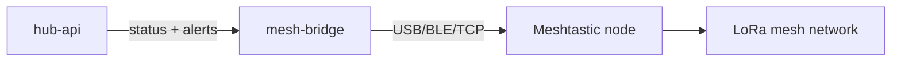

# Meshtastic Integration

Optional LoRa mesh integration for remote status and alerts.

## Design principles

- **Optional** — Hub operates fully without Meshtastic
- **Separate service** — mesh-bridge runs independently from hub-api
- **Low bandwidth** — summaries and alerts only, not full telemetry
- **No cloud** — Meshtastic is peer-to-peer mesh, not a cloud service
- **Rate limited** — prevents mesh congestion

## Architecture



## Use cases

| Use | Supported | Rate limit |
|-----|-----------|------------|
| Status summary | Yes | Every 30–60 minutes |
| Critical alerts | Yes | Immediate, deduplicated |
| Warning alerts | Yes | Immediate, deduplicated |
| Full sensor history | No | — |
| Configuration UI | No | — |
| High-frequency telemetry | No | — |

## Payload schemas

### Status summary

Published every 30 minutes by mesh-bridge.

```json
{
  "type": "plant_hub_status",
  "status": "ok",
  "plants": 8,
  "needs_water": 2,
  "reservoir": 74,
  "water_temp_c": 18.4,
  "tent_temp_c": 19.1,
  "humidity": 68,
  "leak": false
}
```

### Alert

Published immediately on critical/warning alert creation.

```json
{
  "type": "plant_hub_alert",
  "severity": "critical",
  "alert": "leak_detected",
  "message": "Leak detected under reservoir tray"
}
```

## Rate limits

| Type | Rule |
|------|------|
| Summary | Every 30–60 minutes |
| Alert (new) | Immediate |
| Alert (repeat) | No more than every 10–15 minutes unless state changes |
| Dedup | Same alert type + source within 15 min → suppress |

## Software MVP stub

For v1 software development without Meshtastic hardware:

- mesh-bridge accepts status summaries and alerts from hub-api
- Logs JSON payloads to console
- Interface boundary defined for future Python/API integration
- No Meshtastic SDK dependency required for core Hub testing

## Hardware options

| Device | Connection | Notes |
|--------|------------|-------|
| LILYGO T-Beam | USB serial | Popular Meshtastic dev board |
| Heltec LoRa 32 | USB serial | Compact option |
| Existing Meshtastic node | TCP/API | If already in mesh |

## Related documents

- [008-meshtastic-status-alerts spec](../../specs/008-meshtastic-status-alerts/spec.md)
- [Software architecture](../architecture/software-architecture.md)
