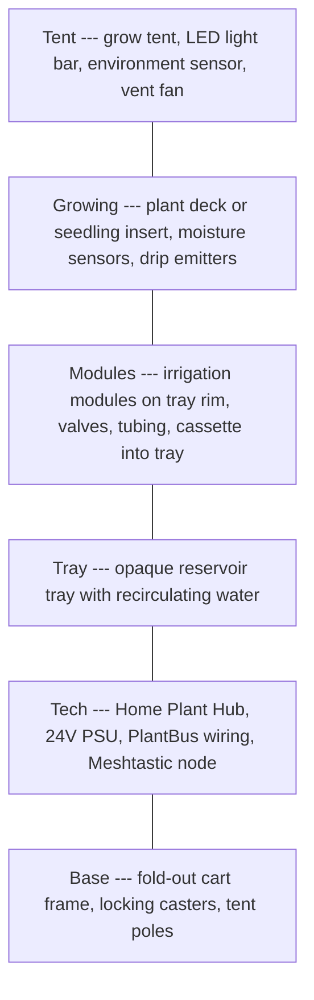

# Onboarding Guide

Welcome to Plant Ark. Start with **why** ([product brief](../product/product-brief.md)), then **principles** ([constitution](../constitution.md)), then dive by role.

## Progressive path

| Phase | Time | Guide | Goal |
|-------|------|-------|------|
| **Day 1** | 30–60 min | [day-1.md](onboarding/day-1.md) | Understand the product and repo map |
| **Week 1** | +1 hr per track | [week-1.md](onboarding/week-1.md) | Role-based deep reading |
| **First contribution** | When ready | [first-contribution.md](onboarding/first-contribution.md) | Ship a traceable spec PR |

## Quick links

| Topic | Document |
|-------|----------|
| Why Plant Ark exists | [Product brief](../product/product-brief.md) |
| Who it's for | [Personas](../product/personas.md) |
| User flows | [User journeys](../product/user-journeys.md) |
| vs AeroGarden / DIY | [Competitive landscape](../product/competitive-landscape.md) |
| Risks | [Risk register](../risks/risk-register.md) |
| Parts list | [Hardware BOM](references/hardware-bom.md) |
| Requirement coverage | [Traceability](../acceptance/traceability.md) |

## What is Plant Ark?

A modular fold-out indoor nursery cart — camping cart meets self-watering seedling tray meets mini grow tent. A **practical gardening appliance** assembled from off-the-shelf tech (Raspberry Pi Hub, ESP32 modules, CAN over Cat5e), not bespoke lab equipment.

## Current phase

**Spec-driven development** — this repo is documentation (requirements, Gherkin, diagrams, acceptance criteria). Code follows bench prototype validation.

## Two modes, same hardware

- **Seedling mode** — tray divided into watering zones
- **Plant mode** — one channel per pot

## PlantBus (30 seconds)

24V DC + CAN over Cat5e. **Not Ethernet.** Label: `PLANTBUS — NOT ETHERNET`.

| Pin | Signal |
|-----|--------|
| 1, 2 | +24V |
| 3, 6 | CAN-H, CAN-L |
| 4, 5 | GND |

Full pinout: [PlantBus physical layer](protocol/plantbus-physical-layer.md).

## FAQ

**Application code?** Not yet — specs first.

**No hardware?** Use the future `simulator` service for Hub/UI work.

**Why CAN?** Deterministic, wired, safe near water. [Competitive landscape](../product/competitive-landscape.md) explains vs DIY Wi-Fi.

**Fail safe?** NC valves close when unpowered; module firmware enforces timeout and leak shutdown independently of Hub.

## Related documents

- [README](../README.md) — full navigation index
- [Glossary](glossary.md)
- [Commercialisation](../roadmap/commercialisation.md)
