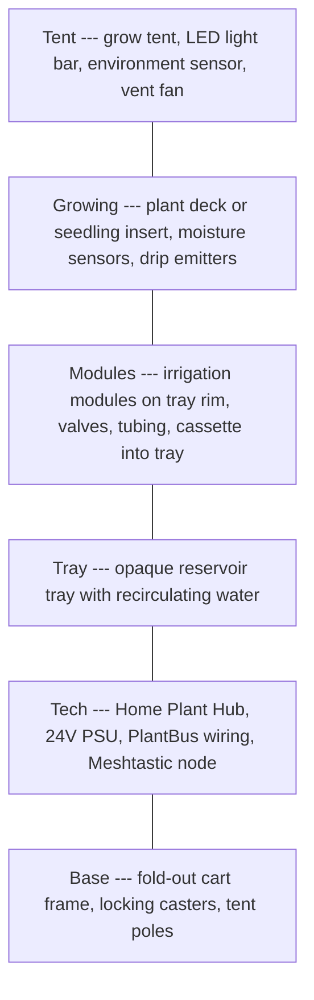

# Day 1 — Orientation

Get oriented with Plant Ark in your first session (~30–60 min). No hardware required.

## Checklist

- [ ] Read [product brief](../../product/product-brief.md) — understand **why** before **what**
- [ ] Read [constitution](../../constitution.md) — ten non-negotiable principles
- [ ] Read [glossary](../glossary.md) — shared vocabulary
- [ ] Skim [repository map](#repository-map) below
- [ ] Pick your [role track](#role-tracks) for Week 1

## What is Plant Ark?

A modular fold-out indoor nursery cart. Off-the-shelf electronics (Raspberry Pi Hub, ESP32 modules, CAN over Cat5e) integrated into a practical gardening appliance — not lab equipment.



**Two modes, same hardware:** seedling mode (zone watering) and plant mode (one channel per pot).

## Current project phase

Spec-driven development (SDD). This repo is **documentation** — requirements, UX flows, architecture, acceptance criteria. Application code follows bench prototype validation.

Next milestones:

1. Procure hardware from the [BOM](../references/hardware-bom.md)
2. 3D print module housings
3. Bench-assemble one irrigation module
4. Implement software MVP against specs (simulator first)

## Repository map

```
plant-ark/
├── product/           ← Why: personas, journeys, competitive, metrics
├── risks/             ← Risk register + hazard analysis
├── constitution.md    ← Principles (start here after product brief)
├── docs/              ← What the system IS (architecture, hardware, protocol)
├── specs/             ← How the system BEHAVES (EARS + Gherkin + sequences)
├── acceptance/        ← MVP pass/fail criteria + traceability
├── roadmap/           ← Scope, commercialisation, future
└── templates/         ← Authoring conventions
```

## Role tracks

Continue in [Week 1](week-1.md) with the track that matches you:

| Track | You are… |
|-------|----------|
| Hardware / electrical | Building the bench prototype |
| Firmware / embedded | Writing module firmware |
| Software / full-stack | Building Hub services and UI |
| Product / design | Reviewing UX flows and product fit |

## Key concepts (5 min)

### PlantBus

24V DC + CAN data over Cat5e — **not Ethernet**. Label every cable: `PLANTBUS — NOT ETHERNET`.

| Pin | Signal |
|-----|--------|
| 1, 2 | +24V DC |
| 3, 6 | CAN-H, CAN-L |
| 4, 5 | GND |
| 7, 8 | Reserved / E-stop |

Canonical pinout: [PlantBus physical layer](../protocol/plantbus-physical-layer.md).

### Safety model

- **Module firmware** enforces safe state independently (pump off, valves closed on timeout/leak)
- **Hub software** enforces global lock, leak lockout, offline block

See [safety requirements](../safety/safety-requirements.md).

## Next step

→ [Week 1 deep reading](week-1.md)  
→ [First contribution](first-contribution.md) when ready to change a spec

## Related documents

- [Onboarding hub](../onboarding.md)
- [Personas](../../product/personas.md)
