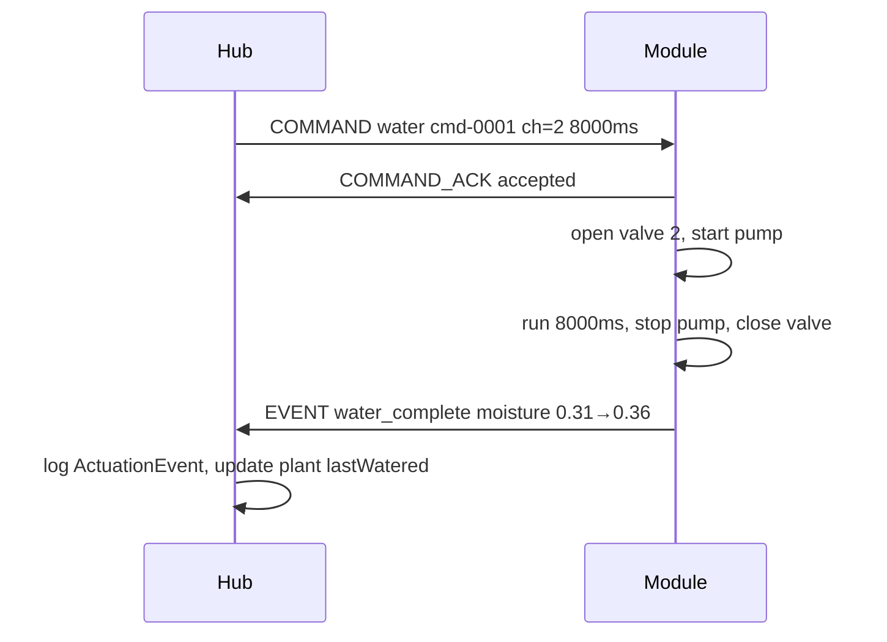

# PlantBus Messages

Message catalog for PlantBus communication. JSON encoding shown for simulator and early development; production firmware targets binary encoding.

## Common fields

All messages include:

| Field | Type | Description |
|-------|------|-------------|
| `type` | string | Message type identifier |
| `module_id` | string | Permanent module ID (e.g. `pm-8f3a91c2`) |
| `timestamp` | string (ISO 8601) | Optional; Hub adds if missing |

## HELLO

Sent by module on power-up. Hub registers module and creates channel slots.

```json
{
  "type": "hello",
  "module_id": "pm-8f3a91c2",
  "module_type": "nursery-4ch-v1",
  "firmware_version": "0.1.0",
  "channels": 4,
  "capabilities": ["moisture", "pump", "valves", "water_level", "leak_sensor", "local_safety"]
}
```

## CAPABILITIES

Extended capability report (optional, after HELLO).

```json
{
  "type": "capabilities",
  "module_id": "pm-8f3a91c2",
  "capabilities": {
    "moisture": { "channels": 4, "unit": "normalized" },
    "pump": { "max_duration_ms": 30000 },
    "valves": { "count": 4, "type": "nc_solenoid" },
    "water_level": { "states": ["ok", "low", "empty"] },
    "leak_sensor": { "type": "conductive" }
  }
}
```

## HEARTBEAT

Periodic liveness signal (default every 30 seconds).

```json
{
  "type": "heartbeat",
  "module_id": "pm-8f3a91c2",
  "status": "online",
  "uptime_s": 3600
}
```

## SENSOR_REPORT

Periodic sensor data (default every 60 seconds, or on change).

```json
{
  "type": "sensor_report",
  "module_id": "pm-8f3a91c2",
  "supply_v": 23.8,
  "water_level": "ok",
  "leak": false,
  "pump_current_ma": 0,
  "water_temp_c": 18.4,
  "channels": [
    { "channel": 1, "moisture_raw": 21540, "moisture_norm": 0.42 },
    { "channel": 2, "moisture_raw": 18120, "moisture_norm": 0.31 },
    { "channel": 3, "moisture_raw": 30210, "moisture_norm": 0.67 },
    { "channel": 4, "moisture_raw": null, "moisture_norm": null }
  ]
}
```

## COMMAND (water)

Hub → module watering command.

```json
{
  "type": "command",
  "command_id": "cmd-0001",
  "module_id": "pm-8f3a91c2",
  "channel": 2,
  "action": "water",
  "duration_ms": 8000,
  "max_duration_ms": 12000
}
```

## COMMAND (identify)

Hub → module identify request.

```json
{
  "type": "command",
  "command_id": "cmd-0002",
  "module_id": "pm-8f3a91c2",
  "action": "identify"
}
```

## COMMAND (stop)

Hub → module emergency stop.

```json
{
  "type": "command",
  "command_id": "cmd-0003",
  "module_id": "pm-8f3a91c2",
  "action": "stop"
}
```

## COMMAND_ACK

Module acknowledges command receipt.

```json
{
  "type": "command_ack",
  "command_id": "cmd-0001",
  "module_id": "pm-8f3a91c2",
  "status": "accepted"
}
```

Rejected example:

```json
{
  "type": "command_ack",
  "command_id": "cmd-0001",
  "module_id": "pm-8f3a91c2",
  "status": "rejected",
  "reason": "water_level_low"
}
```

## EVENT (water_complete)

Module reports watering completion.

```json
{
  "type": "event",
  "module_id": "pm-8f3a91c2",
  "channel": 2,
  "event": "water_complete",
  "command_id": "cmd-0001",
  "actual_duration_ms": 8000,
  "moisture_before": 0.31,
  "moisture_after": 0.36
}
```

## EVENT (fault)

```json
{
  "type": "event",
  "module_id": "pm-8f3a91c2",
  "event": "fault",
  "fault_code": "pump_overcurrent",
  "message": "Pump current exceeded 1500 mA"
}
```

## ERROR

```json
{
  "type": "error",
  "module_id": "pm-8f3a91c2",
  "error_code": "bus_timeout",
  "message": "No Hub communication for 10 seconds"
}
```

## CONFIG_SET / CONFIG_GET

Configuration read/write (v1 minimal — heartbeat interval, sensor report interval).

```json
{
  "type": "config_set",
  "module_id": "pm-8f3a91c2",
  "key": "heartbeat_interval_s",
  "value": 30
}
```

## FIRMWARE_INFO

```json
{
  "type": "firmware_info",
  "module_id": "pm-8f3a91c2",
  "firmware_version": "0.1.0",
  "build_date": "2026-05-01",
  "hardware_revision": "rev-a"
}
```

## Message exchange: watering

See [003-manual-watering/sequence.md](../../specs/003-manual-watering/sequence.md) for full sequence diagram.



## Message exchange: discovery

See [001-module-discovery/sequence.md](../../specs/001-module-discovery/sequence.md).

## CAN frame mapping (production note)

For binary production encoding:

- Standard CAN ID allocation: Hub = 0x000, modules = 0x100–0x17F
- Multi-frame messages use ISO-TP or simple length-prefixed chunking
- JSON phase uses simulator WebSocket transport, not CAN frames

## Related documents

- [PlantBus overview](plantbus-overview.md)
- [Physical layer](plantbus-physical-layer.md)
- [Data model](../data-model/entities.md)
