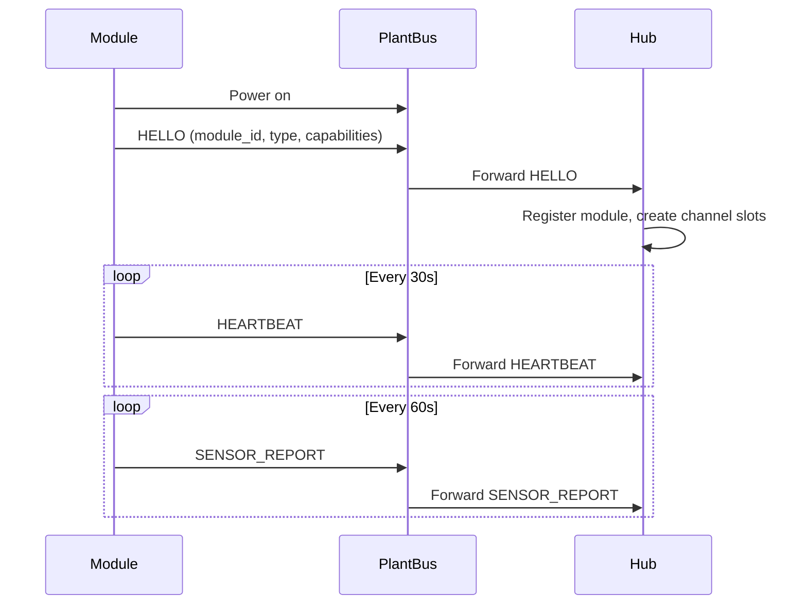

# PlantBus Overview

PlantBus is the internal modular bus connecting the Home Plant Hub to irrigation modules and environment modules.

## Concept

PlantBus should feel like "USB for plant modules" — plug in a module, it announces itself, the Hub creates channel slots, and the user names them. It is **not** USB and does **not** use Ethernet protocol.

## Bus composition

| Layer | Technology |
|-------|------------|
| Power | 24V DC |
| Data | CAN bus (ISO 11898) |
| Cable (prototype) | Cat5/Cat6 twisted pair |
| Connector (prototype) | RJ45 (labelled NOT ETHERNET) |
| Connector (production) | M12 A-coded 5-pin |

## Why CAN

| Property | Benefit |
|----------|---------|
| Multi-drop bus | Multiple modules on one cable |
| Self-announcement | Modules send HELLO on power-up |
| Noise immunity | Robust in electrically noisy environments |
| Cable length | Works over typical cart/tray runs |
| Topology | Daisy-chain or linear bus |
| Ecosystem | Automotive tooling and transceivers widely available |

RS-485 is an acceptable fallback if CAN tooling is unavailable, but CAN is the preferred v1 direction.

## Topology

- Linear bus or daisy-chain
- 120 Ω termination at both physical bus ends
- Fuse and protection at each module input
- Do not depend on physical chain order for module identity — use permanent module IDs

## Module lifecycle on bus

## Message encoding

| Phase | Encoding |
|-------|----------|
| Simulator + early software | JSON over CAN frames (or WebSocket for simulator) |
| Production firmware | Binary encoding (CBOR or custom struct) |

JSON is acceptable for simulator and early development. Binary encoding is the production target.

## Message types

| Type | Direction | Purpose |
|------|-----------|---------|
| HELLO | Module → Hub | Announce identity on power-up |
| CAPABILITIES | Module → Hub | Extended capability report |
| HEARTBEAT | Module → Hub | Liveness signal |
| SENSOR_REPORT | Module → Hub | Periodic sensor data |
| COMMAND | Hub → Module | Water, identify, config |
| COMMAND_ACK | Module → Hub | Command received |
| EVENT | Module → Hub | water_complete, fault, etc. |
| ERROR | Module → Hub | Error report |
| IDENTIFY | Hub → Module | Trigger identify LED/button response |
| CONFIG_SET | Hub → Module | Set module parameters |
| CONFIG_GET | Hub → Module | Read module parameters |
| FIRMWARE_INFO | Module → Hub | Firmware version report |

See [plantbus-messages.md](plantbus-messages.md) for full message schemas.

## Power budget (estimate)

| Consumer | Current @ 24V | Notes |
|----------|---------------|-------|
| Module idle | ~50 mA | MCU + CAN transceiver |
| One valve active | ~200–500 mA | During watering burst |
| Pump active | ~500–1000 mA | 12V pump via regulator |
| Module peak (pump + valve) | ~1.5 A | Short duration |

Size 24V PSU for: Hub + (peak modules × 1) watering concurrently (Hub enforces one-at-a-time by default).

## Related documents

- [Physical layer](plantbus-physical-layer.md)
- [Messages](plantbus-messages.md)
- [Module discovery](../../specs/001-module-discovery/spec.md)
- [Component catalog](../references/component-catalog.md)
