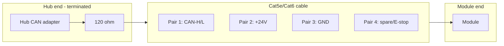

# PlantBus Physical Layer

Electrical and mechanical specification for PlantBus cabling and connectors.

## Power and data

| Signal | Specification |
|--------|---------------|
| Bus power | 24V DC nominal (18–30V acceptable) |
| Bus data | CAN 2.0A/B (ISO 11898-2) |
| Bit rate | 250 kbps (default) or 500 kbps |
| Termination | 120 Ω at each bus end |
| Max nodes | 8 modules + 1 Hub adapter (conservative) |
| Max cable length | 40 m total bus at 250 kbps |

## Prototype RJ45 pinout

**Use Ethernet cable for convenience. Do NOT use Ethernet protocol. Do NOT use PoE. Label all connectors: PLANTBUS — NOT ETHERNET.**

| Pair | Pin (T568B) | Signal | Notes |
|------|-------------|--------|-------|
| Pair 1 | 1, 2 | CAN-H, CAN-L | Twisted pair |
| Pair 2 | 3, 6 | +24V, +24V | Parallel for current capacity |
| Pair 3 | 4, 5 | GND, GND | Parallel for return |
| Pair 4 | 7, 8 | Spare, E-stop | Emergency stop or future use |

### Wiring diagram

## Production connector: M12 A-coded 5-pin

| Pin | Signal |
|-----|--------|
| 1 | +24V |
| 2 | GND |
| 3 | CAN-H |
| 4 | CAN-L |
| 5 | Shield / spare / E-stop |

M12 provides IP67 protection for production builds. RJ45 is prototype-only.

## Module input protection

Each module shall include:

| Protection | Component | Purpose |
|------------|-----------|---------|
| Fuse | 2A slow-blow | Overcurrent |
| Reverse polarity | Schottky diode or MOSFET | Wiring mistake protection |
| TVS diode | 24V bidirectional | Transient suppression |
| ESD | TVS on CAN-H/L | Static discharge |
| Bulk capacitor | 100–470 µF on 24V input | Pump inrush |

## CAN bus rules

| Rule | Value |
|------|-------|
| Termination | 120 Ω at Hub end and last module end only |
| Stub length | < 300 mm per module tap |
| Ground reference | Common GND via Pair 3 |
| CAN transceiver | ISO 11898 compatible |
| SocketCAN interface | Linux Hub (can0) |

## Emergency stop (Pair 4)

Optional E-stop line on Pair 4 pin 7:

- When pulled low: all modules shall stop pump and close valves
- Hub shall also send stop command on bus
- v1: can be wired or software-only; document either approach

## Labelling requirements

| Location | Label text |
|----------|------------|
| Every RJ45 connector | PLANTBUS — NOT ETHERNET |
| Hub CAN port | PLANTBUS OUT |
| Module bus port | PLANTBUS IN / OUT |
| 24V PSU output | 24V DC PLANTBUS |

## Cable routing on cart

- Route along cart frame cable channels, not through reservoir
- Keep data pairs away from pump motor wires where possible
- Secure with clips; allow slack for module removal
- Drip loop before entering dry electronics bay

## Related documents

- [PlantBus overview](plantbus-overview.md)
- [PlantBus messages](plantbus-messages.md)
- [External standards](../references/external-standards.md)
- [Electrical safety](../safety/electrical-safety.md)
