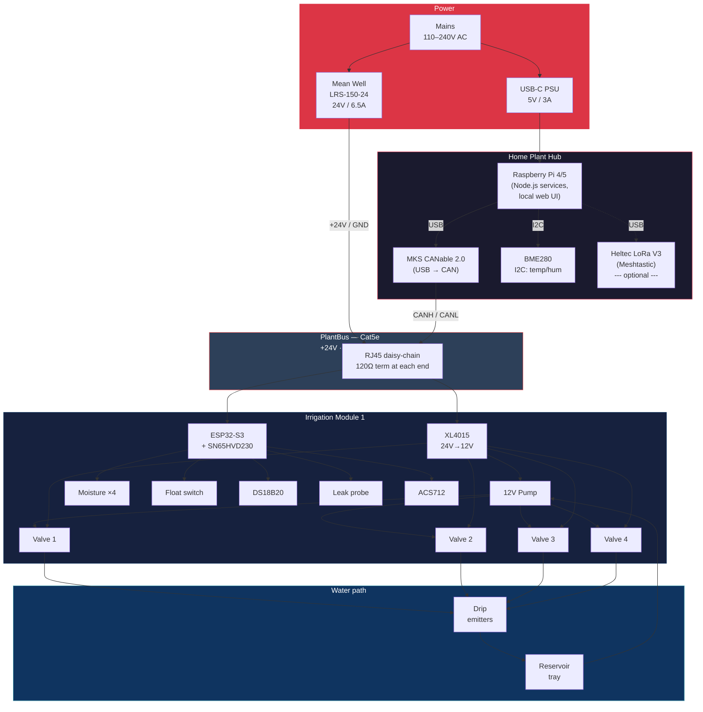
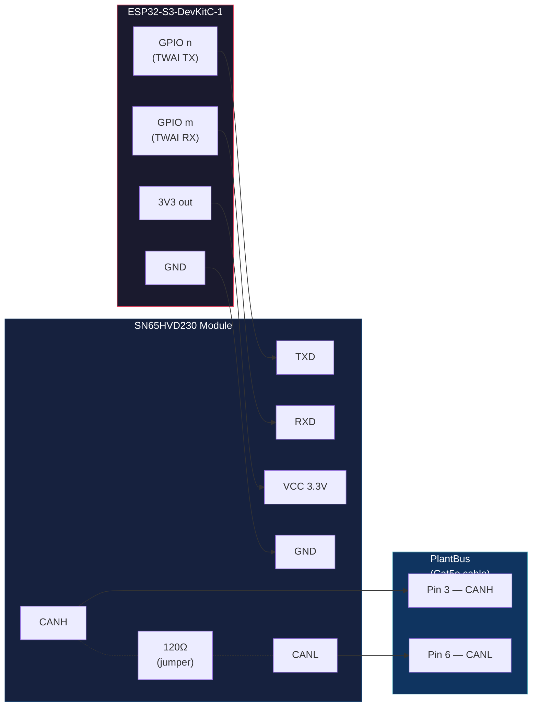
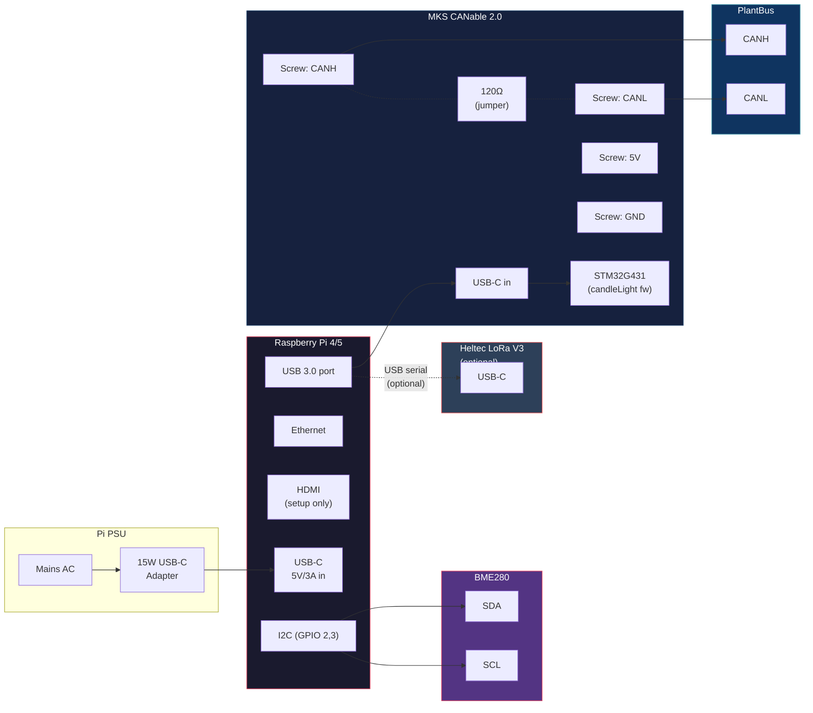
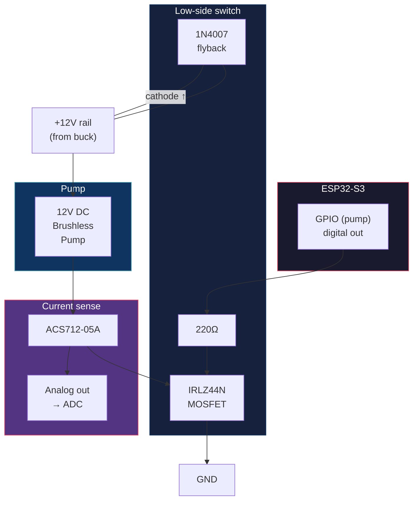
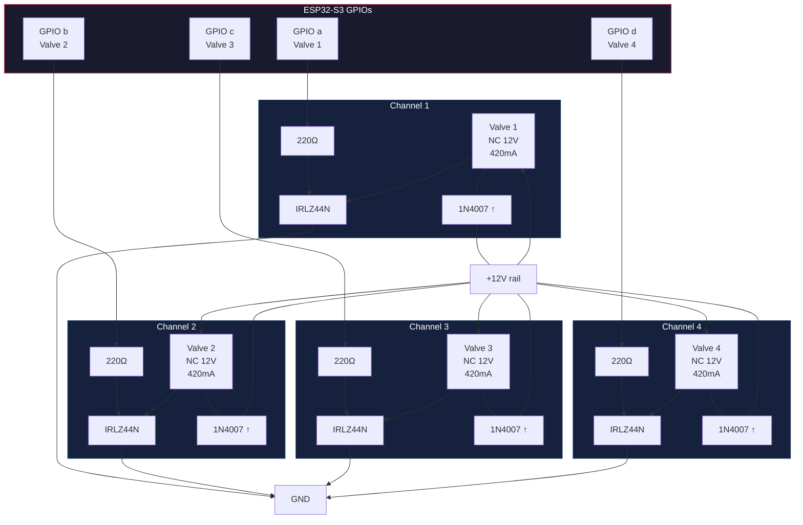
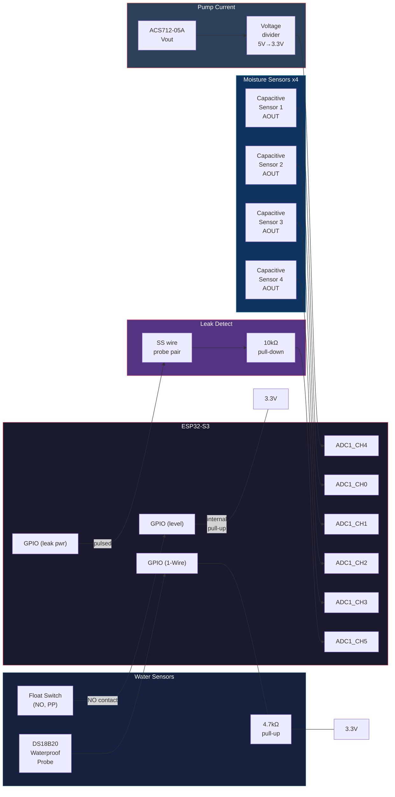
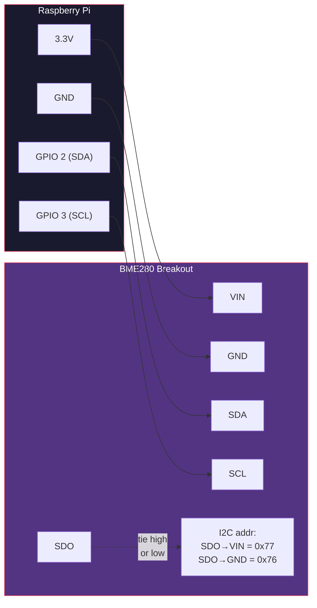
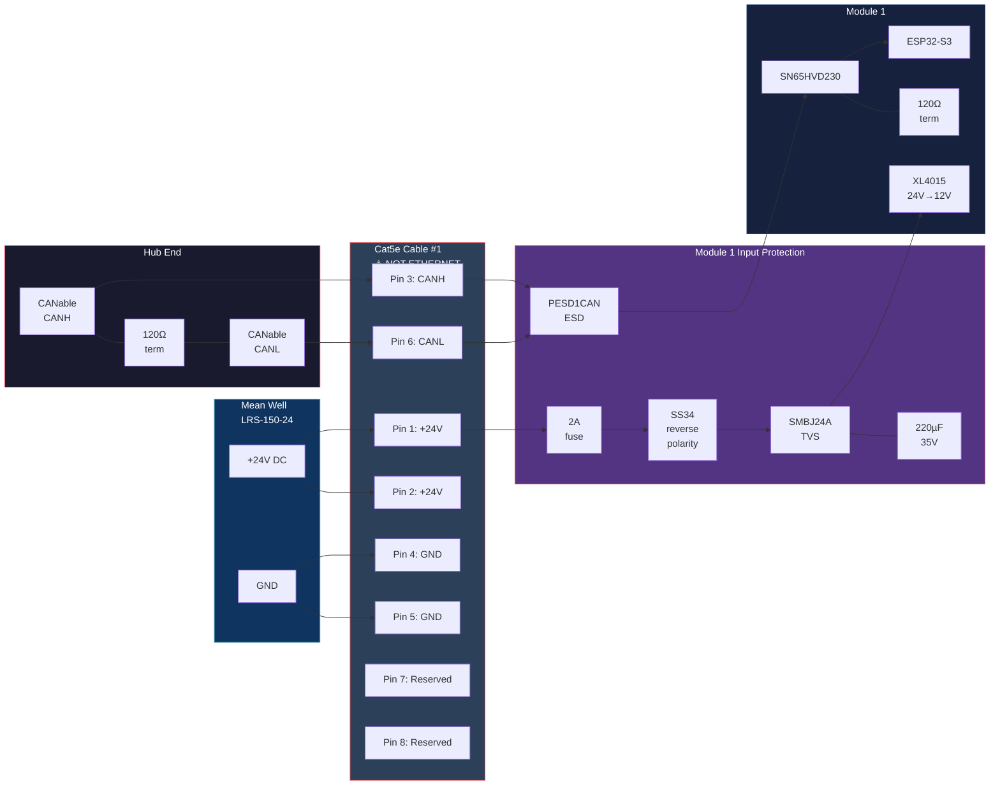
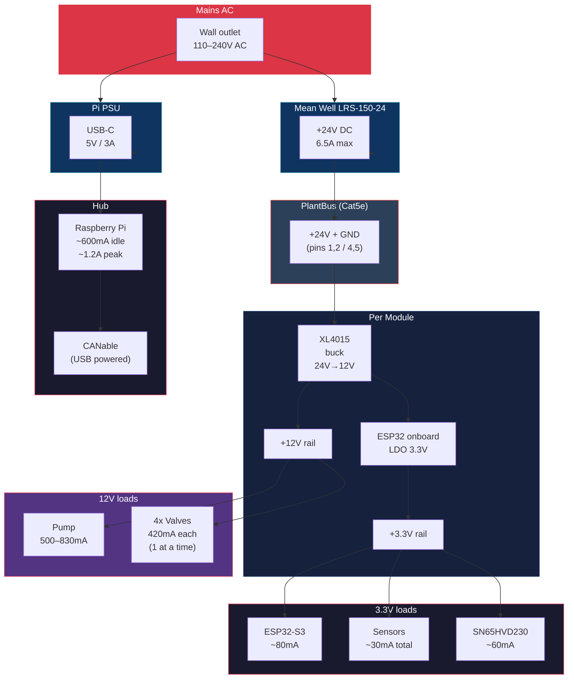
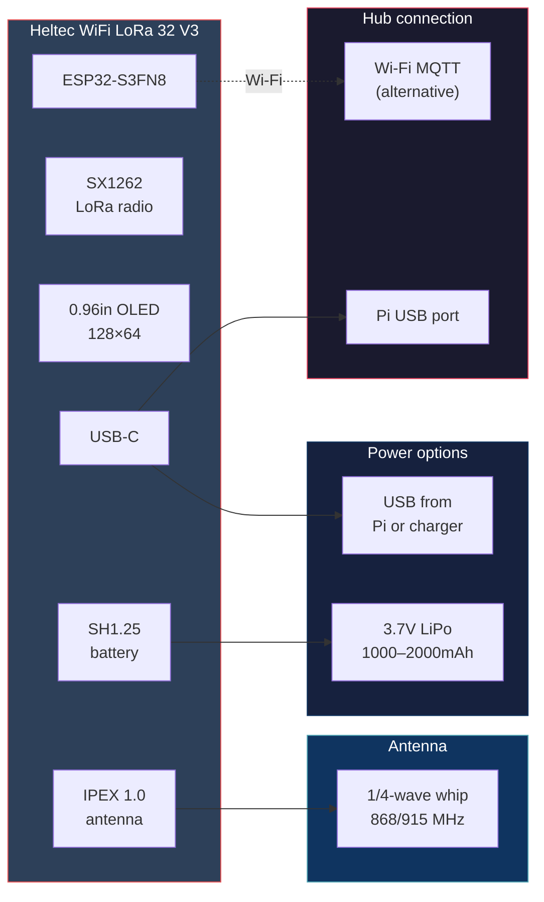

# Hardware Bill of Materials — V1 Prototype

Specific component selections with specs, suppliers, and pricing for the Plant Ark v1 bench prototype. Assumes 3D-printed module housing and cassette enclosure.

All prices are approximate retail (single unit) as of mid-2026. Buying in 2–3 packs or from AliExpress equivalents will reduce costs.

## System wiring overview



## BOM summary

| Subsystem | Cost estimate |
|-----------|---------------|
| Irrigation module (1x) | ~$75–100 |
| Home Plant Hub | ~$85–110 |
| PlantBus cabling + protection | ~$15–25 |
| Sensors (environment) | ~$20–30 |
| Pump, valves, filtration | ~$55–75 |
| Power supply | ~$20–25 |
| Optional Meshtastic | ~$20–30 |
| **Total (1 module, no Meshtastic)** | **~$270–365** |
| **Total (1 module + Meshtastic)** | **~$290–395** |

---

## 1. Irrigation module MCU

### ESP32-S3-DevKitC-1 (N8R2 or N16R8)

The ESP32-S3 has a built-in TWAI controller (CAN 2.0B compatible, ISO 11898-1). No external CAN controller IC needed — only an external transceiver for bus-level voltages.

| Parameter | Value |
|-----------|-------|
| Processor | Dual-core Xtensa LX7, 240 MHz |
| Flash | 8 or 16 MB |
| PSRAM | 2 or 8 MB |
| ADC | 2x 12-bit SAR, up to 20 channels (10 on ADC1) |
| CAN | 1x TWAI (ISO 11898 CAN 2.0B) — GPIO-assignable |
| I/O | Up to 45 GPIO; I2C, SPI, UART, PWM |
| Wireless | Wi-Fi 802.11 b/g/n + BLE 5.0 (not used for PlantBus, useful for debug/OTA) |
| Logic level | 3.3V |
| Power | 3.0–3.6V (USB-C onboard for dev) |
| Dev environment | ESP-IDF (recommended) or Arduino |
| Price | $6–8 (N8R2) / $8–12 (N16R8) per board; 3-pack ~$18 on Amazon |

**Why ESP32-S3:** Built-in CAN controller eliminates an MCP2515; plenty of ADC channels for 4 moisture sensors + water level + pump current; Wi-Fi/BLE available for firmware updates; huge community and library ecosystem; cheap.

**Alternative (cheaper, fewer features):** ESP32-C3 ($3–5) — single core, 1x TWAI, fewer ADC channels. Viable if GPIOs are tight; save $3–5 per module.

**Pinout plan (one module):**

| Function | GPIO | Notes |
|----------|------|-------|
| CAN TX | Any (GPIO matrix) | To SN65HVD230 TXD |
| CAN RX | Any (GPIO matrix) | From SN65HVD230 RXD |
| Moisture sensor 1–4 | ADC1 CH0–CH3 | Analog in, 3.3V |
| Valve driver 1–4 | 4x digital out | To MOSFET gates |
| Pump driver | 1x digital out | To MOSFET gate |
| Water level (float switch) | 1x digital in | Pull-up, active low |
| Leak sensor | 1x digital/analog in | Conductive probe |
| Water temp (DS18B20) | 1x digital (1-Wire) | 4.7 kΩ pull-up |
| Pump current (ACS712) | 1x ADC | Analog in |
| Identify button | 1x digital in | Pull-up, active low |
| Status LED | 1x digital out | RGB or bi-colour |

Total GPIO needed: ~16. ESP32-S3 has 45 available — plenty of headroom.

### ESP32-S3 + CAN transceiver wiring



---

## 2. CAN transceiver

### SN65HVD230 breakout module

| Parameter | Value |
|-----------|-------|
| IC | Texas Instruments SN65HVD230 |
| Standard | ISO 11898, CAN 2.0B |
| Supply voltage | 3.3V (matches ESP32 directly) |
| Data rate | Up to 1 Mbps |
| ESD protection | 16 kV HBM (built in) |
| Bus nodes | Up to 120 |
| Standby current | 370 µA |
| Termination | 120 Ω onboard (enable via jumper) |
| Interface | TXD, RXD → ESP32 TWAI pins; CANH, CANL → bus |
| Price | $0.70–5.00 per module (ElectroPeak $0.71; Waveshare $4.99) |

**Qty needed:** 1 per irrigation module + 1 on the Hub CAN adapter (if using bare adapter).

**Wiring:** 4 pins to ESP32 (3V3, GND, TXD, RXD) + 2 pins to PlantBus (CANH, CANL). Only enable the 120 Ω termination at the two physical bus ends.

---

## 3. Home Plant Hub

### Raspberry Pi 4 Model B (4 GB) — budget pick

| Parameter | Value |
|-----------|-------|
| Processor | BCM2711, Cortex-A72, 1.8 GHz quad-core |
| RAM | 4 GB LPDDR4 |
| Storage | microSD (32 GB recommended) |
| USB | 2x USB 3.0 + 2x USB 2.0 |
| Network | Gigabit Ethernet, Wi-Fi 5, BT 5.0 |
| GPIO | 40-pin header |
| Power | 5V / 3A USB-C |
| Price | ~$55 (4 GB) |
| PSU | 15W USB-C — $8–10 |
| Case | ~$5–10 (passive cooling fine for Hub workload) |

**Alternative (better, slightly more):** Raspberry Pi 5 (4 GB) at ~$60 + 27W PSU at ~$12. Faster, has PCIe for NVMe. Recommended if starting fresh today — the $15 premium pays for 3x performance and future-proofing.

**Why not cheaper SBCs?** SocketCAN support, community, Docker support, and availability make the Pi the safest choice. An Orange Pi 5 (~$40) works too if you're comfortable with Armbian.

### USB-CAN adapter

#### MKS CANable 2.0 (budget)

| Parameter | Value |
|-----------|-------|
| CAN standard | CAN 2.0A/B, up to 1 Mbps |
| Firmware | slcan (stock) / candleLight (recommended for native SocketCAN) |
| Linux driver | gs_usb (candleLight) — appears as can0 |
| Connector | USB-C + 4-pin screw terminal (CANH, CANL, 5V, GND) |
| Termination | Jumper-selectable 120 Ω |
| MCU | STM32G431 (ARM Cortex-M4, 170 MHz) |
| Price | ~$16 |

**Alternative:** Innomaker USB2CAN (~$20–30, gs_usb compatible, sometimes with isolation).

### Hub connection diagram



**Setup on Pi:**

```bash
# with candleLight firmware:
sudo ip link set can0 type can bitrate 250000
sudo ip link set up can0
# now use can-utils: candump, cansend, etc.
```

---

## 4. Submersible pump

### 12V DC brushless mini submersible pump

| Parameter | Target spec | Example models |
|-----------|-------------|----------------|
| Voltage | 12V DC | Generic "JT-180" / "JZW-1323" class |
| Flow rate | 200–400 L/h | 280 L/h typical |
| Max lift | 2–4 m (only need ~0.3 m) | 3 m typical |
| Power | 3–10W | 5W typical |
| Noise | < 35–40 dB | Ultra-quiet brushless |
| Waterproof | IP68 | Fully submersible |
| Inlet/outlet | 6–8 mm barbed | Matches 6 mm LDPE tubing |
| Price | $7–15 | Walmart/AliExpress ~$7; Amazon ~$10–15 |

**Selection criteria:** Brushless motor (no brushes to wear), ceramic shaft, ABS/PC body, quiet operation. Avoid models with RGB LEDs unless you enjoy disco in the reservoir.

**Qty:** 1 per irrigation module.

### Pump driver circuit



---

## 5. Solenoid valves

### U.S. Solid USS2-00005 — 1/4" 12V DC NC nylon

| Parameter | Value |
|-----------|-------|
| Model | USS2-00005 |
| Port | 1/4" NPT (can use barb adapters for 6 mm tubing) |
| Operation | Direct-acting, normally closed |
| Voltage | 12V DC (±10%) |
| Power | 5W (420 mA) |
| Pressure | 0–7 bar (0–101 PSI) — works at zero pressure (direct acting) |
| Flow aperture | 2.5 mm |
| Response | < 1 second open/close |
| IP rating | IP65 |
| Body | Nylon engineering plastic |
| Seal | NBR |
| Price | ~$12 each |

**Qty needed:** 4 per irrigation module = ~$48

**Important:** Direct-acting type works at zero pressure differential — required because the pump provides only low head pressure. Pilot-operated valves need minimum ~0.2 bar and will not reliably open in this system.

**Not food-safe.** Acceptable for ornamental/seedling irrigation. For edible crops, consider food-grade valves (RPE R Mini ~$15–25 each, WRAS/NSF certified).

**Adapter:** 1/4" NPT to 6 mm barb fitting — ~$1 each, 4 needed per module.

---

## 6. Valve driver MOSFETs

### IRLZ44N — logic-level N-channel MOSFET

| Parameter | Value |
|-----------|-------|
| Type | N-channel enhancement mode |
| VDS max | 55V |
| ID max | 47A @ 25 °C |
| VGS(th) | 1.0–2.0V |
| RDS(on) @ VGS=5V | 0.025 Ω |
| RDS(on) @ VGS=4V | 0.035 Ω |
| Package | TO-220 |
| Price | ~$0.35–1.40 each; 10-pack ~$14 |

**3.3V gate drive note:** The IRLZ44N turns on at VGS(th) 1–2V and has low RDS(on) down to VGS=4V. At 3.3V from the ESP32, RDS(on) will be higher (~0.05–0.1 Ω) but for a 420 mA solenoid load this means < 50 mW dissipation — acceptable. For cleaner switching, add a simple NPN level-shift (2N2222 + 10 kΩ) or use a true 3.3V logic-level MOSFET like the **IRLML6344** (SOT-23, VGS(th) 0.8V, RDS(on) 29 mΩ @ VGS=2.5V, ~$0.30 each).

**Qty:** 5 per module (4 valves + 1 pump) = ~$5–7

**Flyback diodes:** 1N4007 (or 1N5819 Schottky) across each valve coil, cathode to +12V. Qty: 4 per module, ~$0.10 each.

**Gate resistors:** 220 Ω between MCU pin and MOSFET gate. Qty: 5 per module.

### 4-channel valve driver circuit



Each valve is driven by a low-side MOSFET. The flyback diode (cathode to +12V) clamps inductive kick when the valve closes. GPIO HIGH = valve open, GPIO LOW = valve closed (NC default).

---

## 7. Sensors

### Soil moisture — Capacitive Soil Moisture Sensor v2.0

| Parameter | Value |
|-----------|-------|
| Sensing type | Capacitive (no exposed metal, corrosion-resistant) |
| Operating voltage | 3.3–5.5V DC |
| Output | Analog voltage (0–3V at 3.3V supply) |
| Interface | 3-pin (VCC, GND, AOUT) → ESP32 ADC |
| Current | ~5 mA |
| Dimensions | 98 × 23 mm probe |
| Price | ~$1.50–3.00 each |
| Qty | 4 per module |

**Calibration required:** Record dry-air reading and submerged reading, normalize to 0.0–1.0 in firmware. Different soil mixes give different ranges.

### Water level — Mini vertical float switch

| Parameter | Value |
|-----------|-------|
| Type | Reed-contact float switch, PP body |
| Switch mode | NO (invertible to NC by flipping float) |
| Max voltage | 100V DC |
| Max current | 0.5A |
| Thread | M8 or M10 (mount through tray wall) |
| Cable | 30–50 cm leads |
| Price | ~$2–5 each (5-pack ~$8) |

**Wiring:** Connect between ESP32 GPIO (with internal pull-up) and GND. Float drops below threshold → switch opens → GPIO reads HIGH → firmware reports "water_level: low".

### Water temperature — DS18B20 waterproof probe

| Parameter | Value |
|-----------|-------|
| Sensor IC | Maxim DS18B20 |
| Interface | 1-Wire digital |
| Range | -55 to +125 °C |
| Accuracy | ±0.5 °C (-10 to +85 °C) |
| Resolution | 9–12 bit configurable |
| Enclosure | 6 mm stainless steel tube, waterproof |
| Cable | 1 m (sufficient for reservoir) |
| Supply | 3.0–5.5V |
| Pull-up | 4.7 kΩ on data line |
| Price | $2–5 (generic); $11 (SparkFun); $20 (Adafruit PTFE high-temp) |
| Qty | 1 per module |

### Leak sensor — DIY conductive probe

| Parameter | Value |
|-----------|-------|
| Method | Two stainless steel wires/traces, 10 mm apart, under tray |
| Detection | Water bridges gap → GPIO reads analog change |
| Wiring | One wire to ESP32 digital out (pulsed power), gap wire to ADC + 10 kΩ pull-down |
| Cost | ~$0 (scrap wire) or $2 for a PCB leak-detect module |
| Qty | 1 per module |

**Pro tip:** Pulse the power pin briefly during reads to prevent electrolysis and extend probe life.

### Pump current — ACS712 (5A version)

| Parameter | Value |
|-----------|-------|
| IC | Allegro ACS712-05A |
| Range | ±5A |
| Sensitivity | 185 mV/A |
| Output | Analog voltage (2.5V at 0A, linear offset) |
| Supply | 5V (use level shifter or voltage divider for ESP32 3.3V ADC) |
| Price | ~$2–4 (breakout module) |
| Qty | 1 per module |

**Alternative (simpler):** A 0.1 Ω shunt resistor in the pump ground line + differential reading. Saves $3 but needs more firmware math.

### Sensor wiring diagram



---

## 8. Environment sensor (tent)

### BME280 breakout module

| Parameter | Value |
|-----------|-------|
| IC | Bosch BME280 |
| Measures | Temperature, humidity, barometric pressure |
| Temperature range | -40 to +85 °C (±1.0 °C) |
| Humidity range | 0–100% RH (±3%) |
| Pressure range | 300–1100 hPa (±1 hPa) |
| Interface | I2C (0x76 or 0x77) or SPI |
| Supply | 3.3V (chip) / 3–5V (breakout with regulator) |
| Current | < 1 mA measuring, 5 µA idle |
| Price | $2–5 (generic GY-BME280); $15 (Adafruit STEMMA QT) |
| Qty | 1 (mount inside tent, away from light bar heat) |

**Connects to:** Hub Pi via I2C (or a dedicated environment ESP32 module on PlantBus for future expansion).

### BME280 I2C wiring



---

## 9. PlantBus cabling and protection

### Cable — Cat5e patch cable

| Item | Spec | Price |
|------|------|-------|
| Cat5e cable, 2 m | Solid copper, unshielded or shielded | ~$3–5 per cable |
| RJ45 connectors | 8P8C crimp or keystone | ~$0.30 each |
| Labels | "PLANTBUS — NOT ETHERNET" | Permanent marker or label tape |

**Qty:** 1–2 cables for v1 (Hub to module 1, module 1 to module 2 if using 2 modules).

### Bus protection (per module input)

| Component | Spec | Price | Qty |
|-----------|------|-------|-----|
| Fuse | 2A slow-blow, 5x20 mm glass or blade | ~$0.50 | 1 |
| Fuse holder | PCB or inline | ~$1.00 | 1 |
| TVS diode | SMBJ24A (24V bidirectional) | ~$0.30 | 1 |
| Schottky diode | SS34 (reverse polarity protection) | ~$0.20 | 1 |
| Bulk capacitor | 220 µF 35V electrolytic | ~$0.30 | 1 |
| CAN ESD TVS | PESD1CAN (dual CAN-H/L) | ~$0.50 | 1 |
| 120 Ω resistor | 1/4W through-hole (bus termination, ends only) | ~$0.05 | 2 total |

**Total per module:** ~$3 in protection components.

### PlantBus topology and protection



**RJ45 pinout (Plant Ark convention):**

| Pin | Pair | Signal | Wire colour (T568B) |
|-----|------|--------|---------------------|
| 1 | 1 | +24V | Orange-white |
| 2 | 1 | +24V | Orange |
| 3 | 2 | CANH | Green-white |
| 4 | 3 | GND | Blue |
| 5 | 3 | GND | Blue-white |
| 6 | 2 | CANL | Green |
| 7 | 4 | Reserved | Brown-white |
| 8 | 4 | Reserved | Brown |

Two pins each for +24V and GND doubles wire capacity to ~1.5A per pair.

---

## 10. 24V power supply

### Mean Well LRS-150-24

| Parameter | Value |
|-----------|-------|
| Output | 24V DC, 6.5A max (156W) |
| Input | 85–264V AC (universal) |
| Efficiency | 89% |
| Certifications | UL, CE, TUV |
| Cooling | Fanless convection |
| Dimensions | 159 × 97 × 30 mm |
| Price | ~$18–25 |

**Capacity check:** Hub (not on 24V), Module idle ~50 mA, Module peak (1 pump + 1 valve) ~1.5A. With 2 modules + headroom: ~3A peak. The LRS-150-24 at 6.5A provides 2x headroom — safe.

**Mounting:** Under tray on dry shelf, enclosed with screw terminals accessible. Keep away from splash zone.

---

## 11. 12V DC-DC regulator (module internal)

### XL4015 or LM2596 buck converter module

| Parameter | Value |
|-----------|-------|
| Input | 24V from PlantBus |
| Output | 12V (adjustable, set to 12.0V) |
| Current | Up to 3A (XL4015) or 2A (LM2596) |
| Efficiency | ~90% |
| Price | ~$1.50–3.00 per module |

Powers the pump (500–830 mA) and is available for valve drive if valves are 12V.

### Power distribution tree



**Power budget per module (peak):**

| Load | Voltage | Current | Power |
|------|---------|---------|-------|
| Pump | 12V | 830 mA | 10.0W |
| Valve (1 open) | 12V | 420 mA | 5.0W |
| ESP32-S3 + CAN | 3.3V | 140 mA | 0.5W |
| Sensors | 3.3V | 30 mA | 0.1W |
| Buck converter loss (~10%) | — | — | 1.6W |
| **Module peak total** | **24V in** | **~720 mA** | **~17.2W** |

---

## 12. Optional Meshtastic node

### Heltec WiFi LoRa 32 V3

| Parameter | Value |
|-----------|-------|
| MCU | ESP32-S3FN8 |
| LoRa | SX1262 |
| Display | 0.96" OLED (128×64) |
| Frequency | 868 MHz (EU) / 915 MHz (NA) |
| Wi-Fi | 802.11 b/g/n |
| Bluetooth | BLE 5.0 |
| Battery | External LiPo via SH1.25 connector |
| USB | USB-C |
| Flash | 8 MB |
| TX power | 21 dBm |
| Price | ~$18–20 (bare board) |
| Antenna | SMA-F to IPEX pigtail included; upgrade to 1/4-wave whip ~$5–10 |

**Setup:** Flash Meshtastic firmware via [flasher.meshtastic.org](https://flasher.meshtastic.org) (< 2 minutes). Connect to Hub Pi via USB serial or Wi-Fi MQTT bridge.

**Total for Meshtastic node:** ~$20–30 (board + antenna + small LiPo).

### Meshtastic node wiring



---

## 13. Miscellaneous hardware

| Item | Spec | Price | Qty |
|------|------|-------|-----|
| 6 mm LDPE tubing (black/opaque) | 4–6 mm ID irrigation tubing | ~$5 for 10 m roll | 1 |
| Barbed tee (bypass) | 6 mm barb, 3-way | ~$0.50 | 1 per module |
| Adjustable drip emitters | 0–40 L/h, 6 mm barb | ~$0.50 each | 4 per module |
| 1/4" NPT to 6 mm barb adapters | For valve-to-tubing connection | ~$1 each | 4 per module |
| Aquarium sponge filter | Coarse cell, cut to cassette size | ~$3 | 1 per module |
| Inline mesh filter (200 mesh) | 6–8 mm inline, stainless or nylon | ~$3–5 | 1 per module |
| Hookup wire | 22 AWG stranded, silicone insulated | ~$8 for assorted set | 1 |
| Heat shrink tubing | Assorted sizes | ~$3 | 1 |
| M3 stainless fasteners | Assorted screws, nuts, standoffs | ~$5 | 1 set |
| Perfboard or prototype PCB | For module electronics assembly | ~$2–5 | 1–2 |
| Dupont jumper wires | M-F, F-F assorted | ~$3 | 1 set |
| Breadboard | For initial testing | ~$3 | 1 |
| 32 GB microSD card | For Pi Hub | ~$5–8 | 1 |

---

## Full BOM — 1 module + Hub (no Meshtastic)

| # | Component | Qty | Unit price | Line total |
|---|-----------|-----|------------|------------|
| 1 | ESP32-S3-DevKitC-1 N8R2 | 1 | $6 | $6 |
| 2 | SN65HVD230 CAN module | 1 | $1 | $1 |
| 3 | 12V brushless submersible pump | 1 | $8 | $8 |
| 4 | U.S. Solid 1/4" 12V NC solenoid valve | 4 | $12 | $48 |
| 5 | IRLZ44N MOSFET (10-pack) | 1 | $14 | $14 |
| 6 | 1N4007 flyback diodes (pack) | 1 | $2 | $2 |
| 7 | Capacitive moisture sensor v2.0 | 4 | $2 | $8 |
| 8 | Mini float switch (5-pack) | 1 | $8 | $8 |
| 9 | DS18B20 waterproof probe 1 m | 1 | $3 | $3 |
| 10 | ACS712-05A current sensor | 1 | $3 | $3 |
| 11 | BME280 breakout (GY-BME280) | 1 | $3 | $3 |
| 12 | Leak detection probe/module | 1 | $2 | $2 |
| 13 | XL4015 buck converter (24V→12V) | 1 | $2 | $2 |
| 14 | Raspberry Pi 4B 4 GB | 1 | $55 | $55 |
| 15 | Pi 4 PSU (15W USB-C) | 1 | $8 | $8 |
| 16 | Pi case (passive) | 1 | $6 | $6 |
| 17 | 32 GB microSD | 1 | $6 | $6 |
| 18 | MKS CANable 2.0 USB-CAN | 1 | $16 | $16 |
| 19 | Mean Well LRS-150-24 (24V PSU) | 1 | $20 | $20 |
| 20 | Cat5e cable 2 m | 1 | $4 | $4 |
| 21 | Bus protection components | 1 set | $3 | $3 |
| 22 | 6 mm LDPE tubing 10 m | 1 | $5 | $5 |
| 23 | Drip emitters, barb adapters, tee | 1 set | $6 | $6 |
| 24 | Aquarium sponge + inline mesh filter | 1 set | $6 | $6 |
| 25 | Hookup wire, heat shrink, fasteners | 1 set | $16 | $16 |
| 26 | Perfboard, breadboard, jumpers | 1 set | $8 | $8 |
| 27 | Resistors (220Ω, 4.7kΩ, 10kΩ assorted) | 1 kit | $3 | $3 |
| | | | **Total** | **~$270** |

---

## Adding a second module

| Component | Additional cost |
|-----------|----------------|
| ESP32-S3 + CAN transceiver | $7 |
| 4x solenoid valves | $48 |
| MOSFETs + diodes + resistors | $5 |
| 4x moisture sensors | $8 |
| Float switch | (share from pack) $0 |
| DS18B20 | (share reservoir) $0 |
| Pump + filter | $11 |
| Buck converter | $2 |
| Cat5e cable | $4 |
| Bus protection | $3 |
| Tubing + fittings | $6 |
| **Second module total** | **~$94** |

---

## Where to source

| Supplier | Best for | Notes |
|----------|----------|-------|
| AliExpress | ESP32, sensors, modules, pumps, generic valves | Cheapest; 2–4 week shipping |
| Amazon | Quick delivery, packs, Pi, CANable | Higher prices, fast shipping |
| U.S. Solid (ussolid.com) | Solenoid valves | Direct, reasonable prices |
| Adafruit / SparkFun | Quality breakouts (BME280, DS18B20) | Premium price, great docs |
| LCSC / JLCPCB | ICs, passives, PCB fabrication | Bulk and future PCB production |
| Mean Well distributors | 24V PSU | Mouser, Digi-Key, or direct |
| Raspberry Pi authorized | Pi boards | rpilocator.com for stock alerts |

## 3D-printed parts (provided by user)

The following enclosures are assumed to be 3D-printed:

| Part | Material | Notes |
|------|----------|-------|
| Module housing (dry bay) | PETG or ASA | Electronics enclosure, above splash line |
| Module housing (valve bay) | PETG | Splash-resistant, valve mount points |
| Pump/filter cassette shell | PETG | Submersible, holds sponge + pump + mesh filter |
| Cassette guide rails | PETG | Glued or screwed to tray wall |
| Identify button + LED mount | PLA/PETG | Front panel of dry bay |
| Cable strain relief | TPU/PETG | PlantBus cable entry grommet |
| Sensor mounts | PLA | Moisture sensor clips, DS18B20 holder |

**Material note:** Use PETG or ASA for anything near water — PLA warps and degrades with moisture over time. TPU is good for flexible gaskets and grommets.

## Design notes

### Solenoid valve alternatives (cost reduction)

The valves are the most expensive single line item. Future options:
- **Latching solenoid valves** (~$15 but need H-bridge driver) — save power for battery builds
- **Pinch valves** (~$5–8 each) — squeeze silicone tubing with a servo or solenoid
- **Multi-port manifold** — single body with 4 built-in valves (~$20–30 vs 4×$12)
- **Gravity-fed + peristaltic** — eliminates valves entirely but changes architecture

### PCB future (v1.5)

When bench testing validates the design, replace perfboard with a custom PCB:
- JLCPCB 2-layer PCB: ~$2 for 5 boards + ~$15 shipping
- Integrate ESP32 module (WROOM-1), CAN transceiver, MOSFET drivers, sensor headers, fuse + protection
- Reduce per-module BOM by ~$10 (fewer breakout boards, fewer jumper wires)

## Related documents

- [Component catalog](component-catalog.md) — selection criteria without specific parts
- [Irrigation module](../hardware/irrigation-module.md) — functional spec
- [PlantBus physical layer](../protocol/plantbus-physical-layer.md) — wiring spec
- [Electrical safety](../safety/electrical-safety.md)
