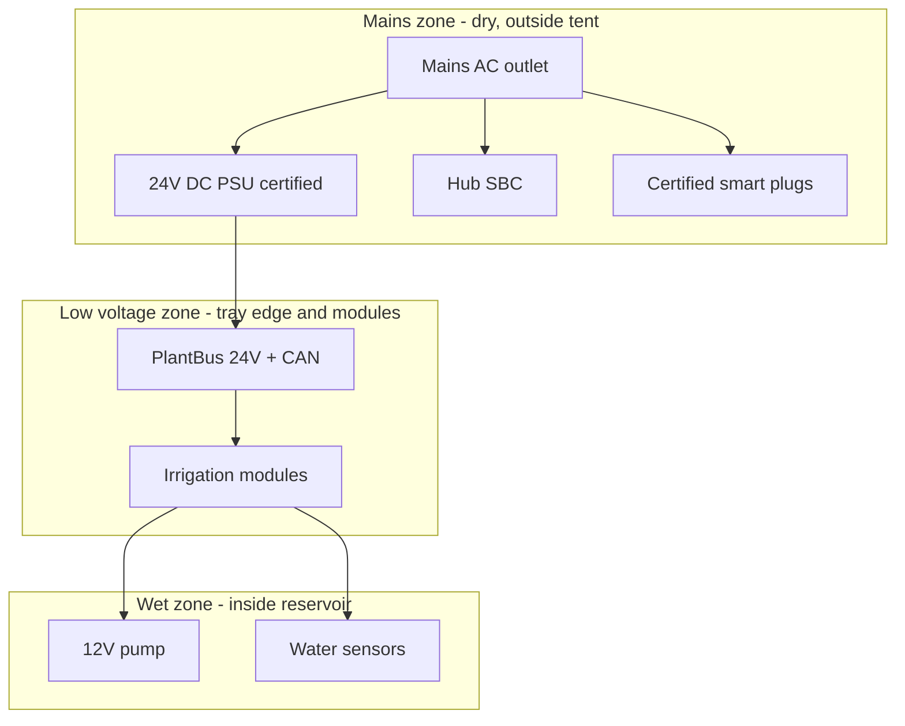

# Electrical Safety

Electrical safety requirements for Plant Ark v1 prototype and future productisation.

## Core rules

| ID | Requirement |
|----|-------------|
| REQ-SAF-E01 | Plant modules shall operate on low-voltage DC (24V) only. |
| REQ-SAF-E02 | Mains AC wiring shall not enter the tray, tent wet zone, or module splash zone. |
| REQ-SAF-E03 | Grow light and fan mains control shall use certified smart plugs or properly enclosed relay modules. |
| REQ-SAF-E04 | The 24V DC power supply shall be certified (UL/CE/GS marked). |
| REQ-SAF-E05 | All PlantBus connectors shall be labelled "NOT ETHERNET" to prevent incorrect wiring. |
| REQ-SAF-E06 | No exposed mains terminals in the cart/tent area accessible during normal operation. |
| REQ-SAF-E07 | The Hub (Raspberry Pi / mini PC) shall be mounted in the dry under-tray zone. |

## Power domain separation

## Module input protection

Each module input shall include:

- 2A slow-blow fuse
- Reverse polarity protection (Schottky or ideal diode MOSFET)
- 24V bidirectional TVS on power input
- ESD protection on CAN-H/L lines
- Bulk capacitor for pump inrush (100–470 µF)

## Grow light safety

- Use a certified LED grow light bar with integrated driver
- Power via certified smart plug — Hub sends on/off only
- No DIY mains wiring inside tent
- Cord routing via tent cable pass-through with drip loop
- v2 dimming: use certified dimmable driver, not DIY TRIAC in wet area

## Prototype bench testing

Before integrating with water:

1. Verify 24V PSU output and fuse
2. Verify CAN bus termination (120 Ω at each end)
3. Verify module boot safe state (pump off, valves closed)
4. Test valve actuation dry (no water)
5. Test leak sensor triggers safe state
6. Test bus timeout triggers safe state
7. Only then connect pump in reservoir with bypass path

## Related documents

- [PlantBus physical layer](../protocol/plantbus-physical-layer.md)
- [Safety requirements](safety-requirements.md)
- [Component catalog](../references/component-catalog.md)
