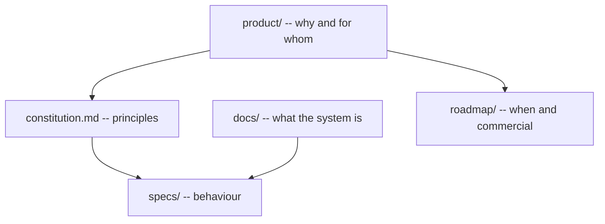

# Product Layer

Why Plant Ark exists, who it is for, and how it differs from countertop smart gardens and DIY setups.

This directory sits **above** the technical specs in `docs/` and `specs/`. It answers product questions; the specs answer engineering questions.

## Documents

| Document | Purpose |
|----------|---------|
| [Product brief](product-brief.md) | Problem, vision, scope, value proposition |
| [Personas and jobs-to-be-done](personas.md) | Who uses Plant Ark and why |
| [User journeys](user-journeys.md) | Commissioning, daily use, incidents, seasonal transitions |
| [Competitive landscape](competitive-landscape.md) | Alternatives and differentiation |
| [Non-functional requirements](non-functional-requirements.md) | Setup time, reliability, accessibility, security |
| [Success metrics](success-metrics.md) | How we measure whether the product works |

## How this relates to other docs

When writing or reviewing a feature spec, check that it serves at least one persona and one job-to-be-done from [personas.md](personas.md).

## Related documents

- [Constitution](../constitution.md)
- [Onboarding guide](../docs/onboarding.md)
- [Commercialisation plan](../roadmap/commercialisation.md)
- [Risk register](../risks/risk-register.md)
