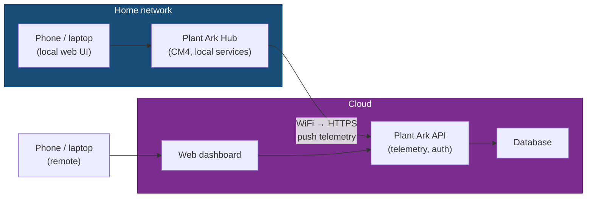

# Commercialisation Plan

How Plant Ark moves from bench prototype to retail product. This document covers the production BOM, connectivity tiers, SKU structure, and the steps between here and a shippable unit.

## Product tiers

Plant Ark ships as a local-first appliance. Cloud connectivity and Meshtastic are add-ons, not dependencies.

| Tier | Connectivity | Remote access | Target customer |
|------|-------------|---------------|-----------------|
| **Core** | Hub serves local web UI on LAN | Phone/laptop on same WiFi | Privacy-first, no internet required |
| **Connected** | Hub syncs to cloud service over WiFi | Manage from anywhere via web/app | Mainstream retail buyer |
| **Off-grid** | Meshtastic LoRa alerts (no internet) | Text alerts over mesh network | Greenhouse, shed, rural, no WiFi |

All three tiers use the same Hub hardware. The CM4 has WiFi and Bluetooth built in. The difference is software: Core ships with local-only services, Connected adds a cloud sync agent, Off-grid adds a Meshtastic bridge and a LoRa node accessory.

## SKU structure

| SKU | Contents | Est. retail |
|-----|----------|-------------|
| PA-HUB-01 | Hub unit (CM4 + carrier + PSU + case + pre-flashed eMMC) | $120–150 |
| PA-MOD-01 | Irrigation module (4-channel, pump, filter cassette, 4 valves, sensors, housing) | $90–110 |
| PA-TRAY-01 | Opaque reservoir tray | $25–35 |
| PA-DECK-01 | Plant deck (pot mode) | $15–20 |
| PA-DECK-02 | Seedling deck (zone mode) | $15–20 |
| PA-TENT-01 | Reflective grow tent | $30–40 |
| PA-CART-01 | Fold-out cart frame with casters | $60–80 |
| PA-KIT-01 | Starter kit (Hub + 1 module + tray + deck + tent + cart + cables) | $320–400 |
| PA-MESH-01 | Meshtastic add-on (Heltec LoRa V3 + antenna + case) | $35–45 |
| PA-CABLE-01 | PlantBus cable 2 m (Cat5e, labelled) | $8–10 |
| PA-FILTER-01 | Replacement filter cassette (sponge + mesh) | $8–10 |

## Production BOM vs development BOM

### Irrigation module

| Component | Dev prototype | Production (100 units) |
|-----------|--------------|------------------------|
| MCU | ESP32-S3-DevKitC-1 board ($6–8) | ESP32-S3-WROOM-1-N4 SMD module ($3.50) |
| CAN transceiver | SN65HVD230 breakout ($1–5) | SN65HVD230DR SOIC-8 IC ($0.37) |
| MOSFET drivers | 5× IRLZ44N TO-220 ($7) | 5× IRLML6344 SOT-23 ($0.75) |
| Flyback diodes | 5× 1N4007 THT ($0.50) | 5× SS14 SMD ($0.15) |
| Current sense | ACS712 breakout ($3) | INA180 + shunt resistor ($0.50) |
| Buck converter | XL4015 module ($2) | XL4015 IC + passives on PCB ($0.80) |
| Protection | Discrete TVS, fuse, caps ($3) | Same, SMD ($1.50) |
| PCB | Perfboard + jumpers ($5) | Custom 2-layer JLCPCB ($1.50) |
| Connectors | Dupont jumpers ($3) | JST-XH headers ($1) |
| Passives | THT resistor kit ($3) | SMD 0603 ($0.30) |
| Pump | Brushless submersible ($8) | Same, OEM ($7) |
| Valves | 4× U.S. Solid retail ($48) | 4× OEM equivalent ($32) |
| Sensors | Breakout modules ($16) | Same sensors, PCB headers ($14) |
| Housing | 3D-printed PETG ($3) | Injection mold amortised ($1.50 @ 1k) |
| **Module total** | **~$105** | **~$64** |

### Hub

| Component | Dev prototype | Production (100 units) |
|-----------|--------------|------------------------|
| SBC | Raspberry Pi 4B 4 GB ($55) | CM4 Wireless 2 GB 8 GB eMMC ($45) |
| Carrier board | N/A | Custom carrier with CAN, power reg ($15) |
| USB-CAN adapter | MKS CANable 2.0 ($16) | MCP2515 + SN65HVD230 on carrier ($2) |
| PSU | Pi PSU + Mean Well ($28) | Single 24V PSU + 5V buck on carrier ($22) |
| Storage | 32 GB microSD ($6) | eMMC on CM4 (included) |
| Case | Off-the-shelf ($6) | Custom enclosure ($2 @ 1k) |
| **Hub total** | **~$111** | **~$84** |

### Full system (1 module)

| | Dev prototype | Production (100 units) | Est. retail |
|---|---|---|---|
| Hub | $111 | $84 | $120–150 |
| Module | $105 | $64 | $90–110 |
| Tray + deck + tent + cart | $80–120 | $50–70 | $120–170 |
| Cables + misc | $25 | $15 | $15–20 |
| **Total** | **~$340** | **~$213** | **~$350–450** |

Retail margin at $400 kit price with $213 COGS: ~47%.

## Hub hardware: Raspberry Pi CM4

The production Hub moves from the full Raspberry Pi 4B to the Compute Module 4. Same BCM2711 processor, same Linux, same software — smaller form factor designed for embedding in products.

| Parameter | Raspberry Pi 4B (dev) | CM4 (production) |
|-----------|----------------------|-------------------|
| Processor | BCM2711, Cortex-A72 1.5 GHz | Same |
| RAM | 4 GB | 2 GB (sufficient for Hub services) |
| Storage | microSD (removable) | 8 GB eMMC (soldered, faster, more reliable) |
| WiFi + BT | Built in | Built in (wireless variant, +$5) |
| Form factor | Full SBC with ports | SODIMM module, needs carrier board |
| CAN interface | USB dongle (CANable) | SPI-CAN on carrier PCB (MCP2515 + SN65HVD230) |
| USB | 4 ports (overkill) | Exposed via carrier, 1 port sufficient |
| HDMI | 2× micro-HDMI | Available on carrier if needed |
| Production commitment | Until 2028 | Until January 2034 |
| Price (wireless, 2 GB, 8 GB eMMC) | $55 (4 GB model) | ~$45 |

The custom carrier board integrates:
- 5V buck regulator (powered from the 24V PlantBus PSU)
- CAN transceiver (SPI-connected, appears as can0 via SocketCAN)
- RJ45 PlantBus jack
- Status LEDs
- USB-C for initial setup and debug
- Optional Meshtastic header (USB or UART)

## Connectivity: cloud service (Connected tier)

The Core tier ships with local-only Hub software. The Connected tier adds a lightweight cloud sync agent running on the Hub.

### Architecture

### What syncs to cloud

| Data | Direction | Frequency |
|------|-----------|-----------|
| Sensor readings (moisture, temp, humidity) | Hub → cloud | Every 5–15 min |
| Watering events | Hub → cloud | On occurrence |
| Alert events | Hub → cloud | On occurrence |
| Module status | Hub → cloud | On change |
| Watering commands | Cloud → Hub | On user action |
| Schedule changes | Cloud → Hub | On user action |

### What stays local

| Data | Reason |
|------|--------|
| Full sensor history | Privacy, storage cost |
| CAN bus traffic | Too granular, no value remotely |
| Video / camera (future) | Bandwidth, privacy |
| PlantBus protocol details | Implementation detail |

### Privacy principle

The Hub always works without cloud. Cloud sync is opt-in, can be paused or disabled at any time, and the user can delete their cloud data. No features are cloud-gated except remote access itself.

## Manufacturing stages

### Stage 1: Bench prototype (current → next)

- Procure dev BOM components
- 3D print module housings
- Assemble 1 irrigation module on perfboard
- Run software MVP against real hardware
- Validate PlantBus over Cat5e, pump control, valve sequencing, sensor reads
- **Gate:** all hardware MVP acceptance criteria pass

### Stage 2: PCB prototype (after Stage 1)

- Design 2-layer module PCB (KiCad, open source)
- Design CM4 carrier board (4-layer, controlled impedance for USB/SPI)
- Fabricate at JLCPCB (5 boards each, ~$20 total)
- SMD assembly via JLCPCB (BOM + pick-and-place)
- Retest all acceptance criteria on PCB version
- **Gate:** PCB module matches perfboard performance

### Stage 3: Pre-production run (10–20 units)

- Refine PCB based on Stage 2 findings
- Source OEM valves and pumps at small volume
- Finalise 3D-printed or early-tooling housings
- Build 10–20 complete kits
- Beta test with real users (friends, community)
- Develop cloud service MVP
- **Gate:** beta feedback incorporated, cloud sync stable

### Stage 4: Production run (100+ units)

- Injection mold tooling for tray, deck, housing ($2k–5k per mold)
- Full BOM sourced at 100-unit pricing
- JLCPCB turnkey assembly
- CE/FCC pre-compliance testing
- Package design, documentation, quick-start guide
- **Gate:** pre-compliance pass, packaging ready

### Stage 5: Retail launch

- CE/FCC/UL certification (if required for market)
- E-commerce storefront
- Kickstarter / crowdfunding option
- First batch: 250–500 kits
- Support infrastructure (docs site, community forum, returns process)

## Certification considerations

| Certification | Required for | Scope | Estimated cost |
|---------------|-------------|-------|----------------|
| CE (EU) | Selling in EU/UK | EMC + electrical safety | $3k–8k |
| FCC Part 15 (US) | Selling in US | Unintentional radiator (ESP32 module is pre-certified) | $2k–5k |
| UL/CSA (US/CA) | Optional but builds trust | Electrical safety | $5k–15k |
| RoHS | EU mandatory | Materials compliance | Included if components are RoHS |
| IP rating | Marketing | Splash resistance for module housing | Self-declared or lab tested ($1k) |

The ESP32-S3-WROOM-1 module and the CM4 wireless module are both pre-certified for RF (FCC/CE/IC). This means the main certification effort is EMC and electrical safety for the assembled product, not the radio itself.

## Open commercial questions

| Question | Options | Preferred |
|----------|---------|-----------|
| Cloud service hosting | Self-hosted (Vercel/Railway) vs managed IoT platform (AWS IoT) | Start with Vercel + Postgres, migrate if scale demands |
| Subscription model | Free local + paid cloud tier vs one-time purchase | One-time purchase, free cloud tier with limits, paid tier for multi-hub |
| Mobile app | Native (React Native) vs PWA | PWA first (cheaper, works everywhere), native later if needed |
| Open source | Fully open vs open hardware / closed cloud | Open hardware + open Hub software, proprietary cloud service |
| First market | Direct-to-consumer vs wholesale / garden centres | DTC via e-commerce + crowdfunding first |

## Related documents

- [Hardware BOM (dev)](../docs/references/hardware-bom.md) — current development parts list
- [Product brief](../product/product-brief.md) — problem, positioning, scope
- [Success metrics](../product/success-metrics.md) — north-star and commercial KPIs
- [V1 scope](v1-scope.md) — what's in the first prototype
- [Future roadmap](future.md) — v1.5, v2, v3 feature plans
- [Non-goals](non-goals.md) — what we're deliberately not building yet
