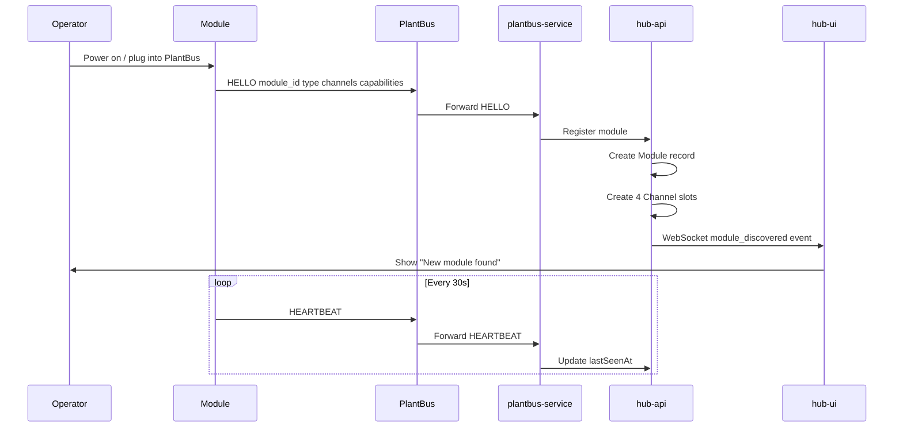
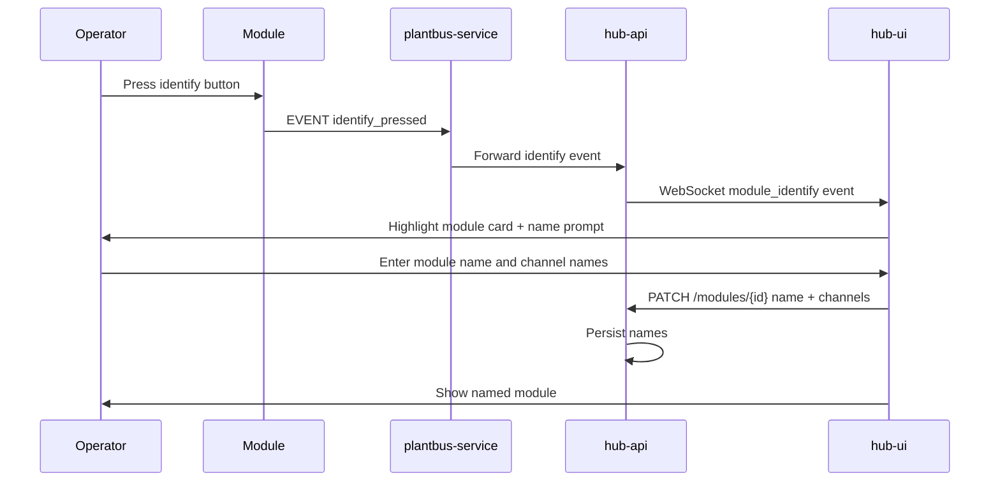
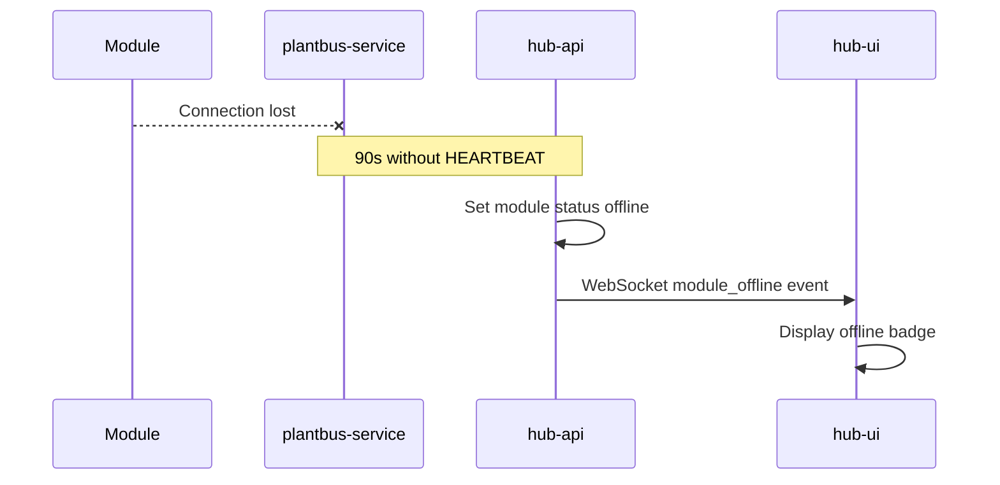

# Module Discovery — Sequence Diagrams

## Module power-on and registration

## Identify flow

## Offline detection

## Related documents

- [spec.md](spec.md)
- [module-discovery.feature](module-discovery.feature)
- [PlantBus messages](../../docs/protocol/plantbus-messages.md)
