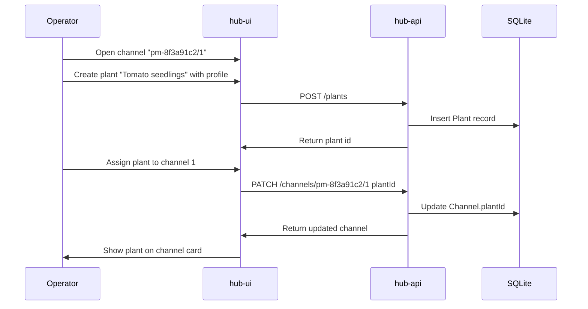
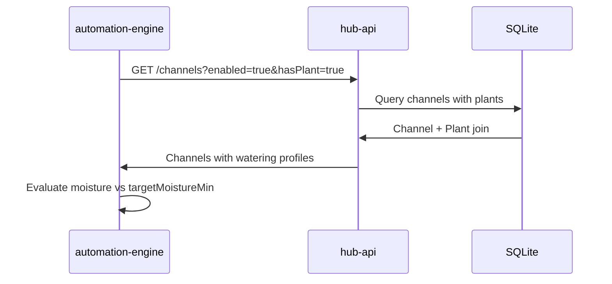

# Channel and Plant Assignment — Sequence Diagrams

## Assign plant to channel

## Automation reads assignment

## Related documents

- [spec.md](spec.md)
- [channel-plant-assignment.feature](channel-plant-assignment.feature)
- [004-automated-watering](../004-automated-watering/spec.md)
