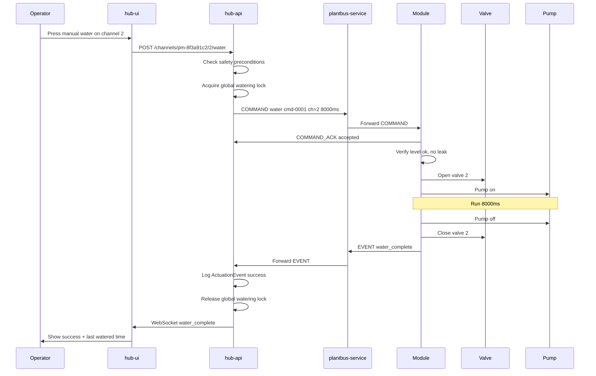
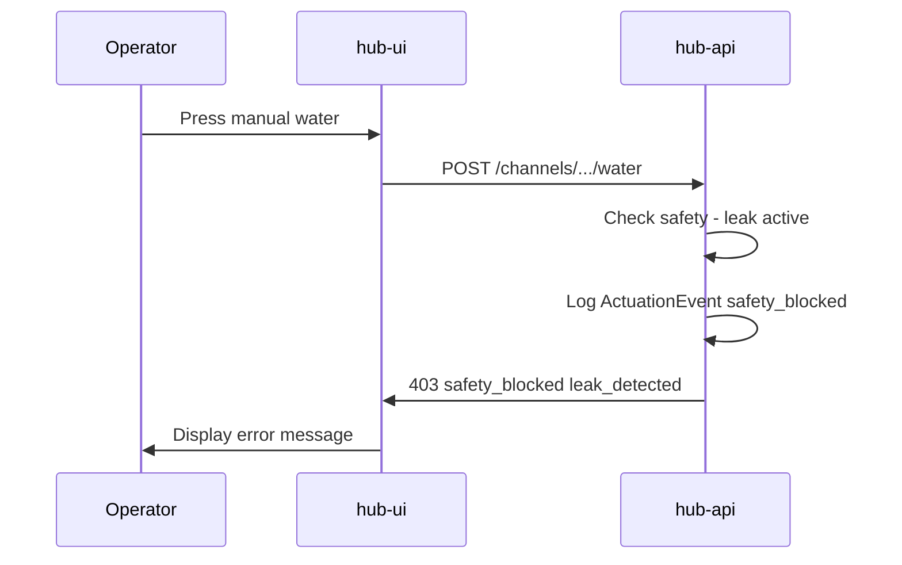

# Manual Watering — Sequence Diagrams

## Successful manual water

## Blocked by safety

## Related documents

- [spec.md](spec.md)
- [manual-watering.feature](manual-watering.feature)
- [005-safety-interlocks](../005-safety-interlocks/spec.md)
