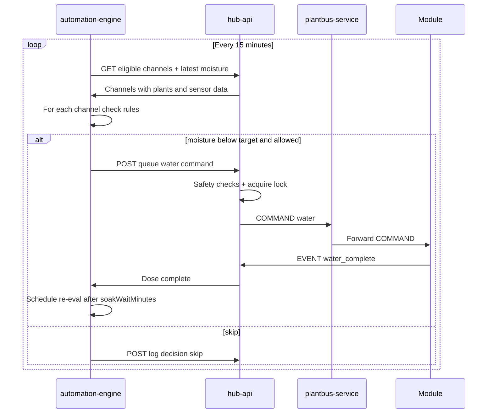
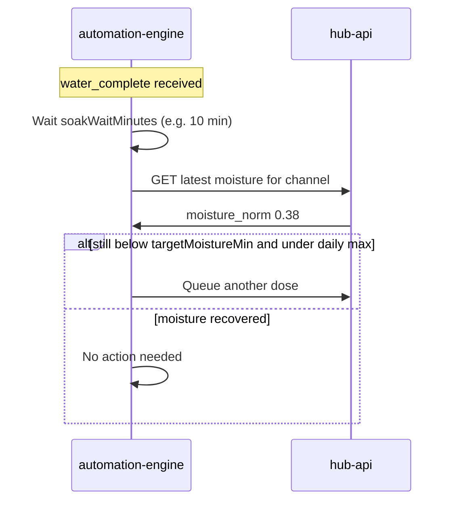

# Automated Watering — Sequence Diagrams

## Automation evaluation loop

## Soak wait and re-evaluation

## Related documents

- [spec.md](spec.md)
- [automated-watering.feature](automated-watering.feature)
- [003-manual-watering](../003-manual-watering/spec.md)
