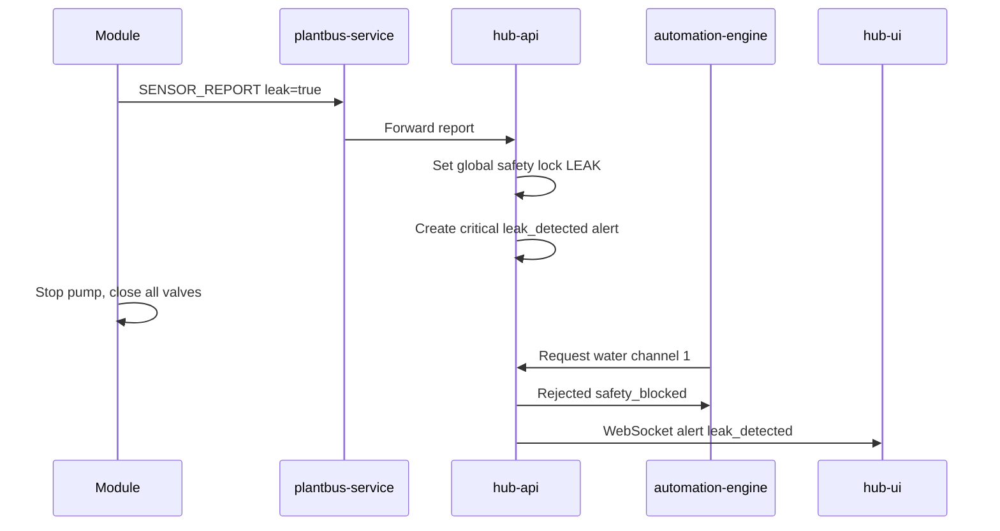
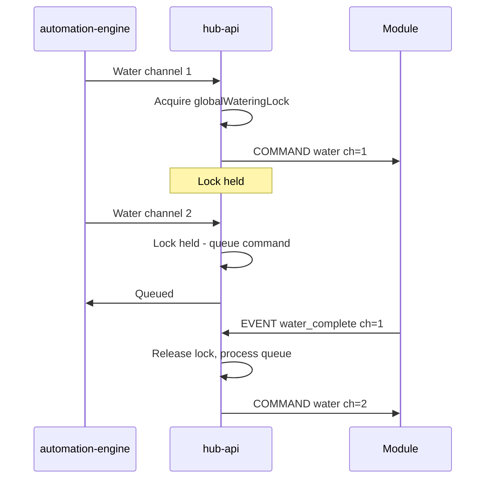
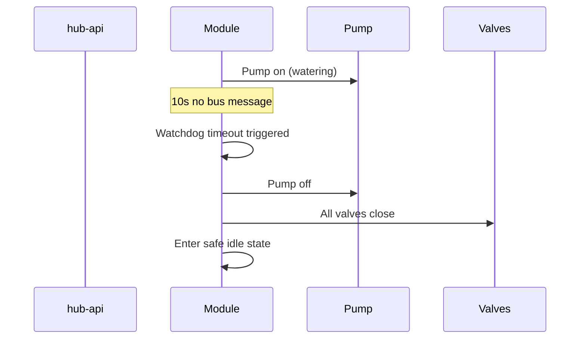

# Safety Interlocks — Sequence Diagrams

## Leak detection and global block

## Global watering lock

## Module bus timeout safe state

## Related documents

- [spec.md](spec.md)
- [safety-interlocks.feature](safety-interlocks.feature)
- [constitution.md](../../constitution.md)
