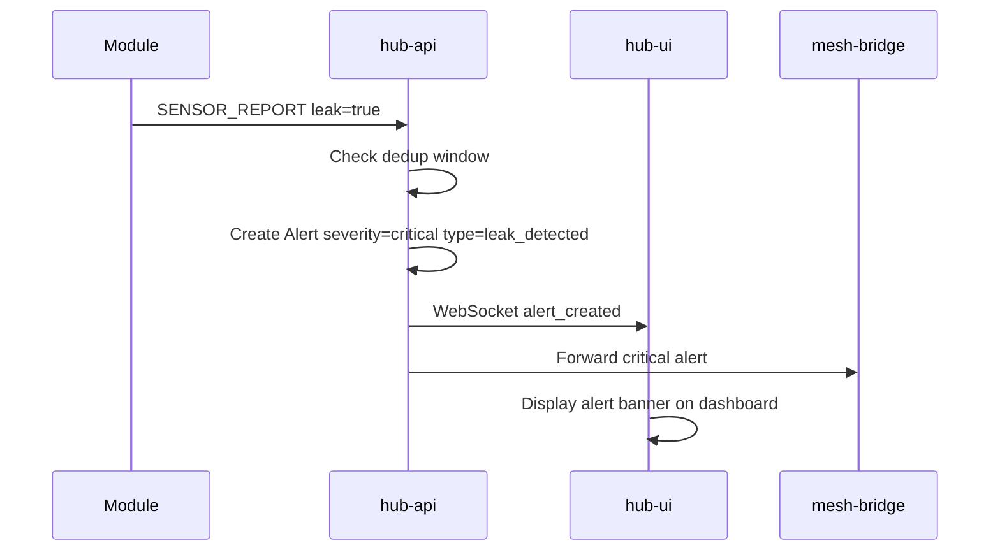
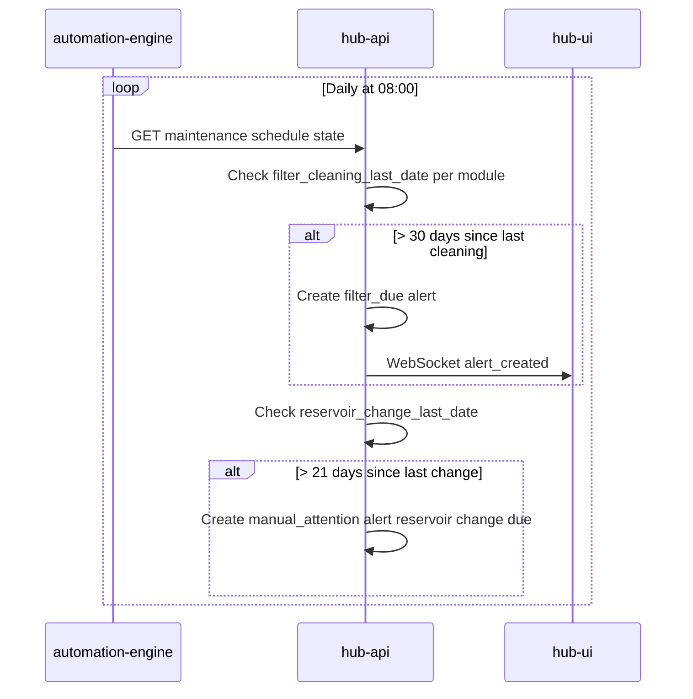
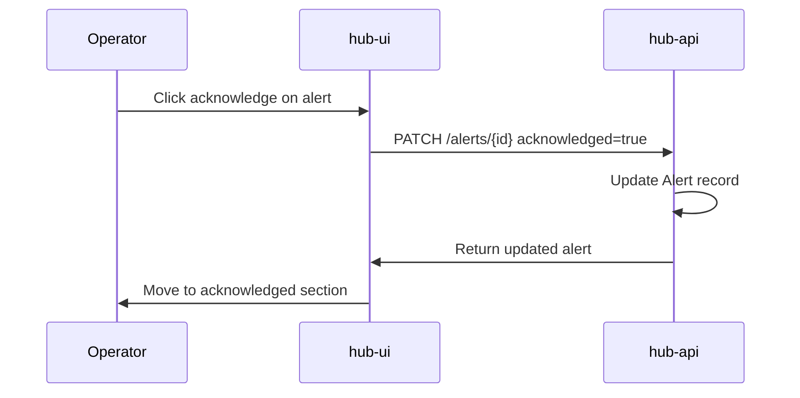

# Alerts and Maintenance — Sequence Diagrams

## Alert creation flow

## Maintenance reminder evaluation

## Acknowledgement

## Related documents

- [spec.md](spec.md)
- [008-meshtastic-status-alerts](../008-meshtastic-status-alerts/spec.md)
