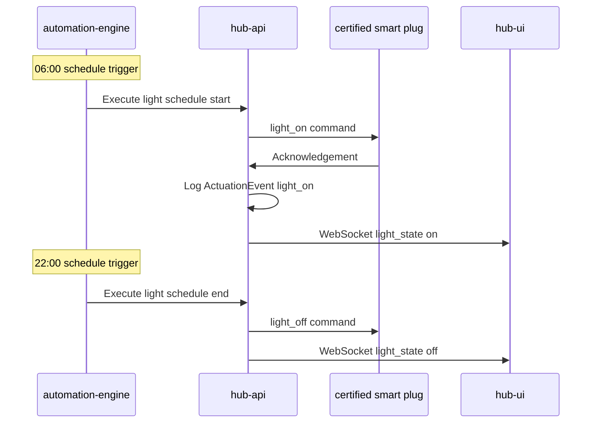
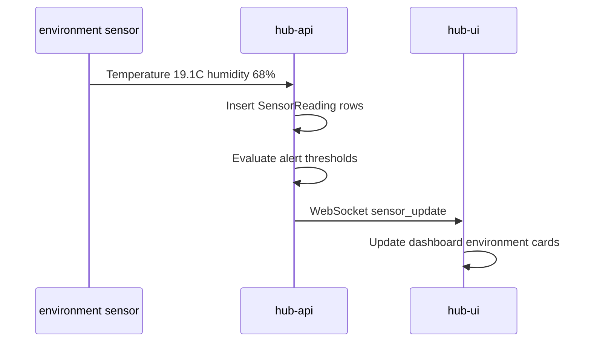

# Environment and Light Control — Sequence Diagrams

## Light schedule

## Environment sensor ingestion

## Related documents

- [spec.md](spec.md)
- [environment-light-control.feature](environment-light-control.feature)
- [009-dashboard-monitoring](../009-dashboard-monitoring/spec.md)
