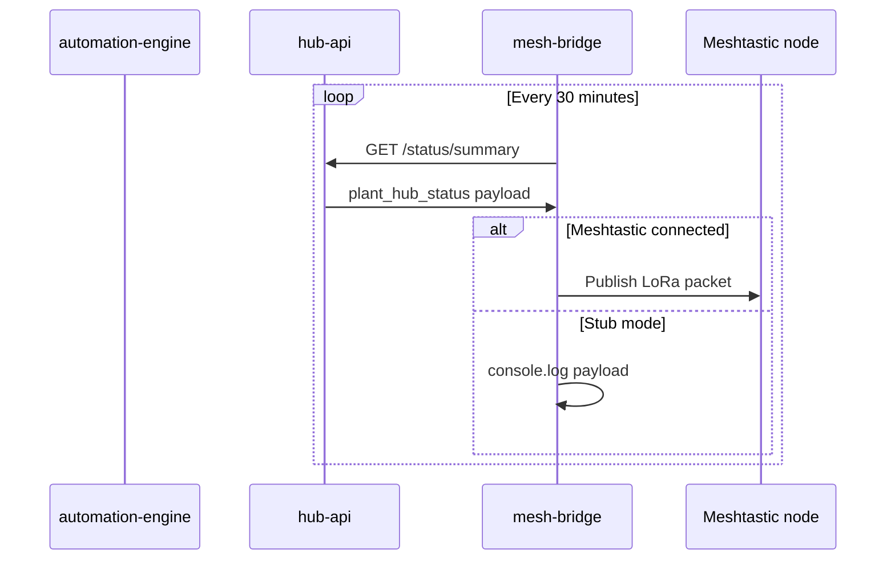
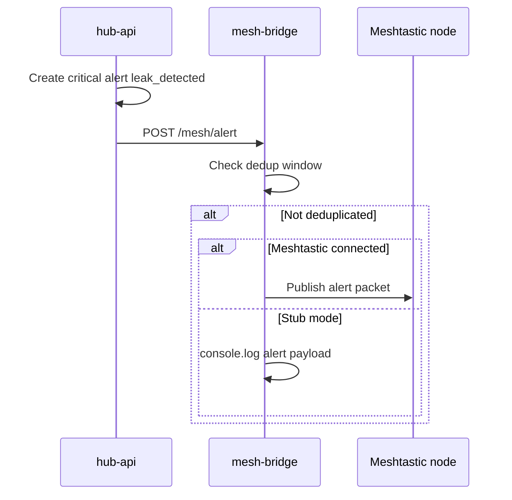

# Meshtastic Status and Alerts — Sequence Diagrams

## Periodic summary publish

## Critical alert publish

## Related documents

- [spec.md](spec.md)
- [meshtastic.md](../../docs/integrations/meshtastic.md)
- [006-alerts-maintenance](../006-alerts-maintenance/spec.md)
