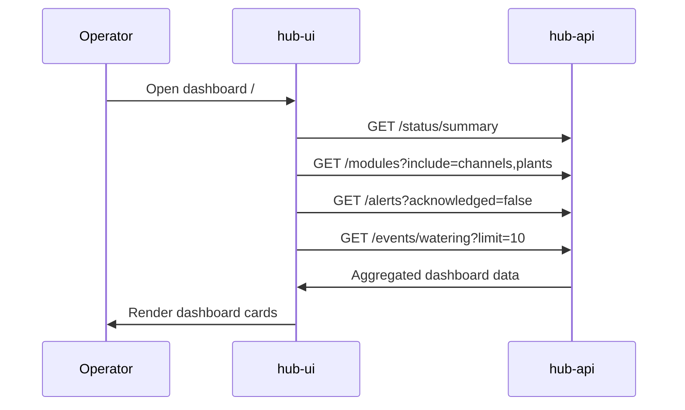
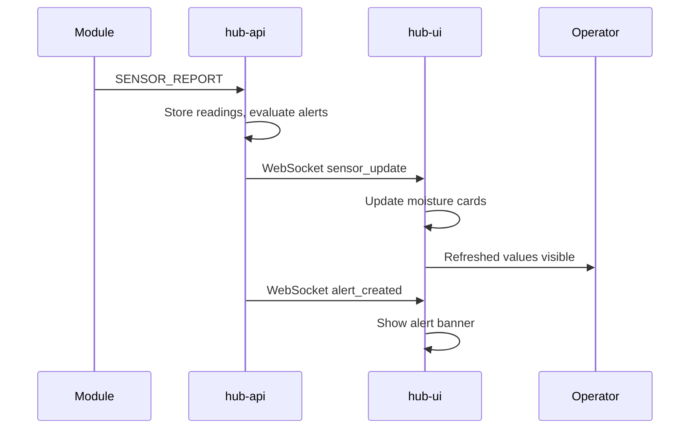

# Dashboard Monitoring — Sequence Diagrams

## Dashboard load

## Real-time WebSocket updates

## Related documents

- [spec.md](spec.md)
- [dashboard-monitoring.feature](dashboard-monitoring.feature)
- [Software architecture](../../docs/architecture/software-architecture.md)
