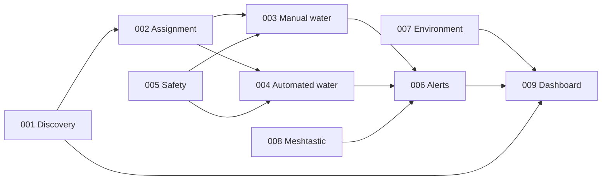

# Plant Ark Feature Spec Index

Feature-sliced specifications for Plant Ark capabilities. Each feature folder contains:

| File | Purpose |
|------|---------|
| `spec.md` | EARS requirements and acceptance criteria |
| `*.feature` | Gherkin UX flows |
| `sequence.md` | Mermaid sequence diagrams for computational workflows |

## Feature list

| ID | Feature | Status | Spec | Gherkin | Sequence |
|----|---------|--------|------|---------|----------|
| 001 | Module discovery | Approved | [spec.md](001-module-discovery/spec.md) | [module-discovery.feature](001-module-discovery/module-discovery.feature) | [sequence.md](001-module-discovery/sequence.md) |
| 002 | Channel / plant assignment | Approved | [spec.md](002-channel-plant-assignment/spec.md) | [channel-plant-assignment.feature](002-channel-plant-assignment/channel-plant-assignment.feature) | [sequence.md](002-channel-plant-assignment/sequence.md) |
| 003 | Manual watering | Approved | [spec.md](003-manual-watering/spec.md) | [manual-watering.feature](003-manual-watering/manual-watering.feature) | [sequence.md](003-manual-watering/sequence.md) |
| 004 | Automated watering | Approved | [spec.md](004-automated-watering/spec.md) | [automated-watering.feature](004-automated-watering/automated-watering.feature) | [sequence.md](004-automated-watering/sequence.md) |
| 005 | Safety interlocks | Approved | [spec.md](005-safety-interlocks/spec.md) | [safety-interlocks.feature](005-safety-interlocks/safety-interlocks.feature) | [sequence.md](005-safety-interlocks/sequence.md) |
| 006 | Alerts and maintenance | Approved | [spec.md](006-alerts-maintenance/spec.md) | [alerts-maintenance.feature](006-alerts-maintenance/alerts-maintenance.feature) | [sequence.md](006-alerts-maintenance/sequence.md) |
| 007 | Environment and light control | Approved | [spec.md](007-environment-light-control/spec.md) | [environment-light-control.feature](007-environment-light-control/environment-light-control.feature) | [sequence.md](007-environment-light-control/sequence.md) |
| 008 | Meshtastic status and alerts | Approved | [spec.md](008-meshtastic-status-alerts/spec.md) | [meshtastic-status-alerts.feature](008-meshtastic-status-alerts/meshtastic-status-alerts.feature) | [sequence.md](008-meshtastic-status-alerts/sequence.md) |
| 009 | Dashboard monitoring | Approved | [spec.md](009-dashboard-monitoring/spec.md) | [dashboard-monitoring.feature](009-dashboard-monitoring/dashboard-monitoring.feature) | [sequence.md](009-dashboard-monitoring/sequence.md) |

## Authoring conventions

1. Copy [templates/spec-template.md](../templates/spec-template.md) and [templates/feature-template.feature](../templates/feature-template.feature) when adding features.
2. Assign stable `REQ-{AREA}-{NNN}` IDs — area codes: `DIS`, `CHN`, `MAN`, `AUT`, `SAF`, `ALT`, `ENV`, `MESH`, `DSH`.
3. Every requirement must appear in [acceptance/traceability.md](../acceptance/traceability.md).
4. Conform to [constitution.md](../constitution.md).

## Dependency map

## Related documents

- [Constitution](../constitution.md)
- [Software MVP acceptance](../acceptance/software-mvp.md)
- [Hardware MVP acceptance](../acceptance/hardware-mvp.md)
